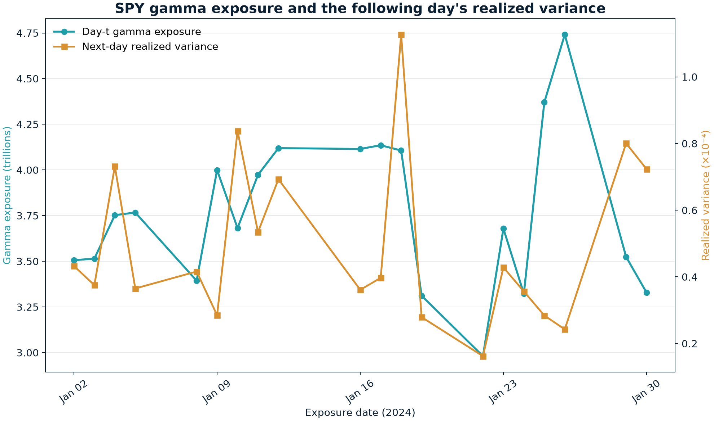
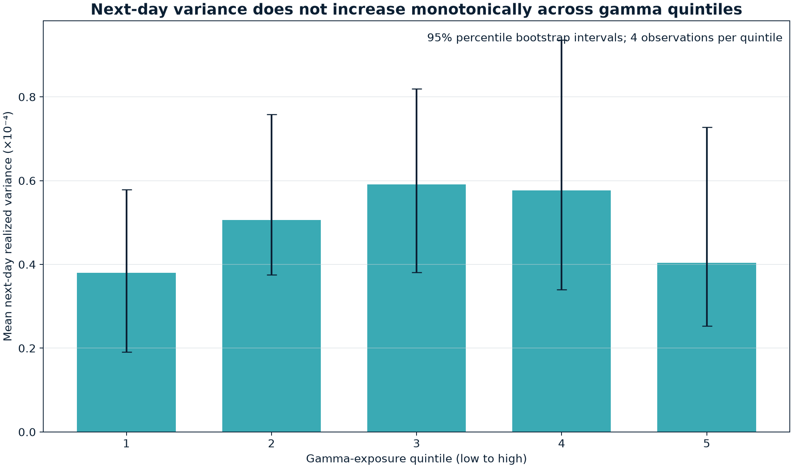
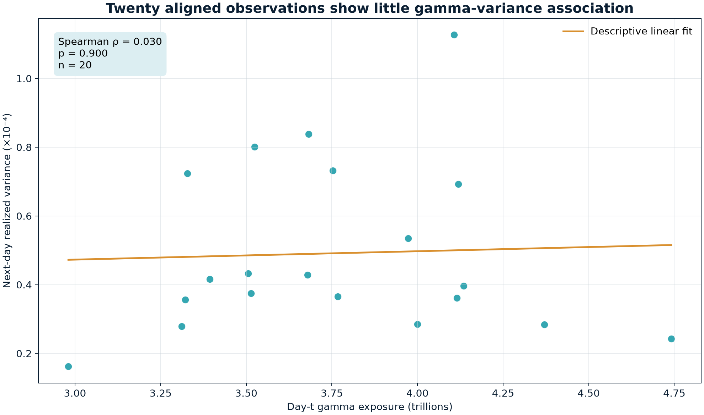

# SPY Gamma Without an Invented Dealer Sign

The usual gamma story is appealing. Dealers who are long gamma hedge against a
price move and may dampen it; dealers who are short gamma hedge with the move
and may amplify it. But an option chain with open interest and Greeks does not
say who owns each position. Without that missing sign, a dataset cannot identify
dealer gamma.

I originally let the code call its daily sum `net_gamma_exposure`. An audit
showed that this was wrong: the series equalled `absolute_gamma_exposure` on all
21 dates, and the supposed negative-gamma node never existed. The corrected
engine now reports exactly what the inputs support: unsigned,
open-interest-weighted gamma mass.

The renamed factor still produces a useful empirical question. Is gamma mass on
SPY option snapshot date $t$ associated with intraday realized variance on the
next observed trading date, $t+1$? In January 2024, the answer is no. The sample
has only 20 aligned observations, so this is a diagnostic result, not a settled
claim about market microstructure.

## What the chain can and cannot measure

For option contract $i$ on date $t$, define:

- $OI_{i,t}$: open interest, measured in contracts;
- $M=100$: shares represented by one standard SPY option contract;
- $S_t$: the SPY closing price, measured in dollars per share;
- $\Gamma_{i,t}$: long-option gamma, the change in delta for a one-dollar move
  in SPY, measured in inverse dollars;
- $m_{i,t}$: the contract's open-interest-weighted gamma mass.

The engine computes

$$
m_{i,t}=OI_{i,t} M S_t^2 \Gamma_{i,t}.
$$

The units are worth tracing. Contracts cancel with contracts, shares cancel
with shares, and $S_t^2\Gamma_{i,t}$ leaves one dollar. Thus $m_{i,t}$ is a
dollar-scaled curvature measure for a unit proportional spot move. For the more
familiar one-percent convention, define

$$
m_{i,t}^{1\%}=0.01m_{i,t}.
$$

The daily total over the set $\mathcal O_t$ of retained contracts is

$$
G_t=\sum_{i\in\mathcal O_t}m_{i,t},
\qquad
G_t^{1\%}=0.01G_t.
$$

This is not expected dealer hedge flow. To estimate hedge flow, I would also
need position ownership and sign, the price move, and assumptions about when
and how dealers rebalance. Open interest is an unsigned stock of outstanding
contracts, not a dealer inventory field.

Standard long calls and puts both have non-negative gamma. The corrected
cleaner makes that data contract explicit:

```python
open_interest_weighted_gamma = (
    open_interest * CONTRACT_MULTIPLIER * spot_close * spot_close * gamma
)
```

Negative vanilla gamma is now rejected as invalid vendor data rather than
misread as a short position. The daily interface contains
`total_open_interest_weighted_gamma`, `near_spot_gamma_mass_share`,
`front_expiry_gamma_mass_share`, `largest_gamma_mass_strike_distance`,
`call_put_gamma_mass_imbalance`, and `gamma_mass_concentration_index`. The old
net, absolute, positive-node, and negative-node fields are gone.

## The response is next-day realized variance

Let $P_{t,j}$ denote the close of minute $j$ on trading date $t$. The minute log
return $r_{t,j}$ is

$$
r_{t,j}=\log(P_{t,j})-\log(P_{t,j-1}).
$$

If date $t$ has $n_t$ valid minute returns, its realized variance $RV_t$ is

$$
RV_t=\sum_{j=1}^{n_t}r_{t,j}^2.
$$

Realized variance is dimensionless because each log return is dimensionless.
Its square root is realized volatility over the sampled session, before any
annualization.

Each research row pairs $G_t$ with $RV_{t+1}$. Here $t+1$ is the next trading
date present in the exposure calendar, not the next calendar day. The join is
deliberately explicit:

```python
ordered_exposures = exposures.sort("trade_date")
exposure_calendar = ordered_exposures.with_columns(
    pl.col("trade_date").shift(-1).alias("_next_exposure_date")
)
aligned = exposure_calendar.join(
    response_payload,
    left_on="_next_exposure_date",
    right_on="_response_join_date",
    how="inner",
)
```

That shift prevents a same-day response from leaking into its own predictor and
handles weekends without manufacturing dates.

## What the corrected run shows

The raw option file contains 168,762 rows. Cleaning retains 131,215. It removes
37,547 rows with non-positive open interest, or 22.25% of the input; 24,331
retained rows have zero gamma. No negative gamma row appears in the shipped
sample.

Across 21 dates, $G_t$ ranges from $2.98 trillion to $4.74 trillion in the raw
unit-proportional-move scale. The one-percent equivalents, $G_t^{1\%}$, are
$29.81 billion to $47.41 billion. These are gamma-mass scales, not predicted
trades.



The two lines vary, but their peaks and troughs do not line up consistently.
The most obvious variance spike occurs while gamma mass is near the middle of
its observed range.

To test monotonic association, I use Spearman rank correlation. Let $R(G_t)$ be
the rank of gamma mass and $R(RV_{t+1})$ the rank of next-day realized variance.
With $\operatorname{Cov}$ denoting covariance and $\sigma$ denoting standard
deviation,

$$
\rho_s=
\frac{\operatorname{Cov}\left(R(G_t),R(RV_{t+1})\right)}
{\sigma_{R(G)}\sigma_{R(RV)}}.
$$

The estimate is $\rho_s=0.030$ with a two-sided p-value of $0.900$. A
Kruskal-Wallis test across five gamma-mass quintiles gives $H=4.786$ and a
p-value of $0.310$. Neither test rejects its null hypothesis at conventional
levels.

| Check | Result | Reading |
|---|---:|---|
| Aligned observations | 20 | One month is too short for a stable estimate |
| Spearman rank correlation | 0.030 | Almost no monotonic association |
| Spearman p-value | 0.900 | The rank relation is compatible with noise |
| Kruskal-Wallis statistic | 4.786 | Quintile distributions are not clearly separated |
| Kruskal-Wallis p-value | 0.310 | No rejection across five quintiles |



Each quintile contains four observations. Mean next-day variance rises from
$3.80\times10^{-5}$ in the first quintile to $5.91\times10^{-5}$ in the third,
then falls to $4.04\times10^{-5}$ in the fifth. The 95% percentile-bootstrap
intervals overlap widely. There is no monotonic dose-response pattern here.



The fitted line is only a visual summary. It is not an out-of-sample forecast.
The scatter and rank statistic both say that this month contains little evidence
of a relationship.

## What survives the audit

Renaming the factor does not alter its values, ordering, quantiles, or test
statistics. It alters the economic claim attached to those values. That is the
point of the correction.

Several structural factors remain valid because they need no ownership sign.
For example, the near-spot share asks how much total gamma mass sits within a
configured moneyness band, and the concentration index is a
Herfindahl-Hirschman Index over strike-expiry shares. The call-put imbalance
describes composition between option types; it is not a long-short dealer
signal.

The configured regime model needs 20 prior observations before assigning a
label. The walk-forward comparison also needs 20 training rows before its first
score. After next-day alignment, exactly 20 rows remain, so both result tables
are empty. Lowering those safeguards just to produce a number would weaken the
research design.

The first-half and second-half rank correlations are $-0.188$ and $0.152$, with
p-values of $0.603$ and $0.676$. Ten observations per half cannot establish
instability, but the sign change gives no support for a durable effect.

## What a signed dealer-gamma study would require

A signed study needs data that distinguish customer and dealer positions, or at
least trade direction and a documented inventory model. A call-positive,
put-negative shortcut does not solve the problem: long calls and long puts are
both long gamma. Such a shortcut mixes option type with position side.

A stronger design would add several years of snapshots, record the exact
observation timestamp, handle corporate actions and expiries explicitly, and
evaluate any signing rule against actual flow or inventory data. The unsigned
factor should remain as a benchmark. Comparing it with each signed estimate
would reveal how much of a result comes from observable gamma concentration and
how much comes from the inventory assumption.

This January run does not validate the familiar dealer-gamma narrative. It does
something more modest and more defensible: it measures observable option
curvature, preserves time order, reports a null result, and refuses to invent a
position sign.

## References

- Fischer Black and Myron Scholes, [The Pricing of Options and Corporate Liabilities](https://doi.org/10.1086/260062), *Journal of Political Economy*, 1973.
- Options Clearing Corporation, [Characteristics and Risks of Standardized Options](https://www.theocc.com/company-information/documents-and-archives/options-disclosure-document), option mechanics and standardized contract risks.
- Options Industry Council, [What Is an Option?](https://www.optionseducation.org/optionsoverview/what-is-an-option), contract structure and the standard 100-share unit.
- Options Industry Council, [Gamma](https://www.optionseducation.org/advancedconcepts/gamma), gamma definition and interpretation.
- Torben G. Andersen, Tim Bollerslev, Francis X. Diebold, and Paul Labys, [Modeling and Forecasting Realized Volatility](https://doi.org/10.1111/1468-0262.00418), *Econometrica*, 2003.
- Andrea Barbon and Andrea Buraschi, [Gamma Fragility](https://doi.org/10.1093/rfs/hhaa048), *Review of Financial Studies*, 2021.
