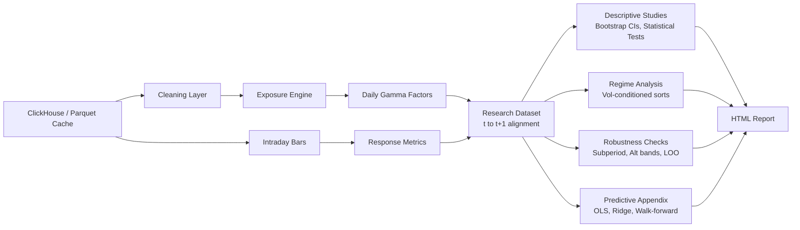

# Portfolio Improvements Implementation Plan

> **For agentic workers:** REQUIRED SUB-SKILL: Use superpowers:subagent-driven-development (recommended) or superpowers:executing-plans to implement this plan task-by-task. Steps use checkbox (`- [ ]`) syntax for tracking.

**Goal:** Upgrade the gamma exposure engine with statistical rigor, richer robustness checks, and engineering polish to make it portfolio-ready for general quant role interviews.

**Architecture:** The existing six-layer pipeline (data, cleaning, exposure, intraday, research, reporting) stays intact. New research modules (bootstrap, statistical_tests, regime, multi_factor) extend Layer 5. The CLI gets a typer wrapper, and all modules gain structured logging. The HTML report gains new sections for CIs, statistical tests, regime analysis, multi-factor summaries, and expanded robustness/predictive tables.

**Tech Stack:** Python 3.12, Polars, Plotly, scikit-learn, scipy, typer, pytest, GitHub Actions

---

## File Map

**New files:**

| File | Responsibility |
|------|---------------|
| `src/gamma_exposure_engine/research/bootstrap.py` | Nonparametric bootstrap CIs on quantile summary metrics |
| `src/gamma_exposure_engine/research/statistical_tests.py` | Kruskal-Wallis and Spearman rank correlation tests |
| `src/gamma_exposure_engine/research/regime.py` | Volatility regime classification and conditional quantile sorts |
| `src/gamma_exposure_engine/research/multi_factor.py` | Cross-factor and factor-target Spearman correlation matrices |
| `tests/research/test_bootstrap.py` | Bootstrap CI tests |
| `tests/research/test_statistical_tests.py` | Statistical test module tests |
| `tests/research/test_regime.py` | Regime conditioning tests |
| `tests/research/test_multi_factor.py` | Multi-factor summary tests |
| `.github/workflows/ci.yml` | GitHub Actions CI pipeline |

**Modified files:**

| File | Changes |
|------|---------|
| `pyproject.toml` | Add scipy, typer deps; add `[project.scripts]` entry point |
| `src/gamma_exposure_engine/config.toml` | New research config entries |
| `src/gamma_exposure_engine/settings.py` | New fields on `ResearchSettings` |
| `src/gamma_exposure_engine/research/descriptive.py` | Subperiod stability, alternative bands, leave-one-month-out |
| `src/gamma_exposure_engine/research/predictive.py` | Ridge baseline, expanding-window diagnostics, prediction intervals |
| `src/gamma_exposure_engine/reporting/charts.py` | Error bar support on quantile chart, expanding-window line chart |
| `src/gamma_exposure_engine/reporting/html_report.py` | New report sections |
| `src/gamma_exposure_engine/cli.py` | typer CLI, structured logging, orchestrate new research steps |
| `tests/test_settings.py` | Update hermetic config for new fields |
| `tests/research/test_descriptive.py` | Tests for new robustness functions |
| `tests/research/test_predictive.py` | Tests for Ridge, diagnostics, prediction intervals |
| `tests/test_cli_smoke.py` | Update for typer CLI and new report sections |
| `README.md` | Full rewrite for portfolio presentation |
| `GUIDE_ROOT.md` | Update for new modules |

---

### Task 1: Add dependencies and config foundation

**Files:**
- Modify: `pyproject.toml`
- Modify: `src/gamma_exposure_engine/config.toml`
- Modify: `src/gamma_exposure_engine/settings.py`
- Modify: `tests/test_settings.py`

- [ ] **Step 1: Add scipy and typer to pyproject.toml**

In `pyproject.toml`, add `scipy` and `typer` to the `dependencies` list, and add the `[project.scripts]` entry point:

```toml
dependencies = [
    "clickhouse-connect>=0.15.1",
    "jinja2>=3.1.6",
    "plotly>=6.6.0",
    "polars>=1.39.3",
    "scikit-learn>=1.8.0",
    "scipy>=1.15.0",
    "streamlit>=1.56.0",
    "typer>=0.15.0",
]
```

And after `[build-system]`:

```toml
[project.scripts]
gex = "gamma_exposure_engine.cli:app"
```

- [ ] **Step 2: Add new config entries to config.toml**

Append to the `[research]` section of `src/gamma_exposure_engine/config.toml`:

```toml
# Number of bootstrap resampling iterations for confidence intervals.
bootstrap_iterations = 1000
# Confidence level for bootstrap percentile intervals (0 to 1).
bootstrap_confidence_level = 0.95
# Trailing window for volatility regime classification (trading days).
regime_lookback_window = 20
# Alpha candidates for Ridge regression cross-validation in the predictive appendix.
ridge_alpha_candidates = [0.01, 0.1, 1.0, 10.0, 100.0]
# Alternative near-spot band widths tested in the robustness section.
# These recompute near_spot_gamma_share under each band for sensitivity analysis.
robustness_band_widths = [0.01, 0.03, 0.05]
```

- [ ] **Step 3: Add new fields to ResearchSettings**

In `src/gamma_exposure_engine/settings.py`, add the new fields to the `ResearchSettings` dataclass:

```python
@dataclass(frozen=True)
class ResearchSettings:
    """Research knobs shared by the explorer and downstream analytics."""

    near_spot_band_width: float
    abnormal_volume_window: int
    quantile_count: int
    pinning_candidate_count: int
    predictive_min_train_size: int
    near_spot_share_thresholds: tuple[float, ...]
    default_factor_name: str
    default_target_name: str
    report_filename_template: str
    bootstrap_iterations: int
    bootstrap_confidence_level: float
    regime_lookback_window: int
    ridge_alpha_candidates: tuple[float, ...]
    robustness_band_widths: tuple[float, ...]
```

- [ ] **Step 4: Update the settings loader for new fields**

In the `load_settings` function in `src/gamma_exposure_engine/settings.py`, add parsing for the new fields inside the `ResearchSettings` constructor call:

```python
    research = ResearchSettings(
        near_spot_band_width=float(research_config["near_spot_band_width"]),
        abnormal_volume_window=int(research_config["abnormal_volume_window"]),
        quantile_count=int(research_config["quantile_count"]),
        pinning_candidate_count=int(research_config["pinning_candidate_count"]),
        predictive_min_train_size=int(research_config["predictive_min_train_size"]),
        near_spot_share_thresholds=tuple(
            float(value) for value in research_config["near_spot_share_thresholds"]
        ),
        default_factor_name=research_config["default_factor_name"],
        default_target_name=research_config["default_target_name"],
        report_filename_template=research_config["report_filename_template"],
        bootstrap_iterations=int(research_config["bootstrap_iterations"]),
        bootstrap_confidence_level=float(research_config["bootstrap_confidence_level"]),
        regime_lookback_window=int(research_config["regime_lookback_window"]),
        ridge_alpha_candidates=tuple(
            float(value) for value in research_config["ridge_alpha_candidates"]
        ),
        robustness_band_widths=tuple(
            float(value) for value in research_config["robustness_band_widths"]
        ),
    )
```

- [ ] **Step 5: Update the hermetic test config**

In `tests/test_settings.py`, update the `write_settings_files` function's TOML string to include the new fields in the `[research]` section:

```toml
bootstrap_iterations = 1000
bootstrap_confidence_level = 0.95
regime_lookback_window = 20
ridge_alpha_candidates = [0.01, 0.1, 1.0, 10.0, 100.0]
robustness_band_widths = [0.01, 0.03, 0.05]
```

And update the assertions in `test_load_settings_uses_explicit_paths_and_does_not_create_outputs_dir` to verify:

```python
    assert settings.research.bootstrap_iterations == 1000
    assert settings.research.bootstrap_confidence_level == 0.95
    assert settings.research.regime_lookback_window == 20
    assert settings.research.ridge_alpha_candidates == (0.01, 0.1, 1.0, 10.0, 100.0)
    assert settings.research.robustness_band_widths == (0.01, 0.03, 0.05)
```

- [ ] **Step 6: Update make_settings in test_cli_smoke.py**

In `tests/test_cli_smoke.py`, update the `make_settings()` helper to include the new `ResearchSettings` fields:

```python
research = (
    ResearchSettings(
        near_spot_band_width=0.02,
        abnormal_volume_window=20,
        quantile_count=5,
        pinning_candidate_count=5,
        predictive_min_train_size=20,
        near_spot_share_thresholds=(0.2, 0.4, 0.6),
        default_factor_name="net_gamma_exposure",
        default_target_name="next_day_realized_variance",
        report_filename_template="{symbol}_{start_date}_{end_date}_gamma_report.html",
        bootstrap_iterations=1000,
        bootstrap_confidence_level=0.95,
        regime_lookback_window=20,
        ridge_alpha_candidates=(0.01, 0.1, 1.0, 10.0, 100.0),
        robustness_band_widths=(0.01, 0.03, 0.05),
    ),
)
```

Do the same for the `test_run_pipeline_writes_html_report_from_real_pipeline` function's inline `ResearchSettings`.

- [ ] **Step 7: Run tests to verify config foundation**

Run: `uv run pytest tests/test_settings.py tests/test_cli_smoke.py -v`
Expected: All tests PASS

- [ ] **Step 8: Install new dependencies**

Run: `uv sync`
Expected: scipy and typer installed successfully

- [ ] **Step 9: Commit**

```bash
git add pyproject.toml uv.lock src/gamma_exposure_engine/config.toml src/gamma_exposure_engine/settings.py tests/test_settings.py tests/test_cli_smoke.py
git commit -m "feat: add scipy, typer deps and v2 research config fields"
```

---

### Task 2: Bootstrap confidence intervals

**Files:**
- Create: `src/gamma_exposure_engine/research/bootstrap.py`
- Create: `tests/research/test_bootstrap.py`

- [ ] **Step 1: Write the failing tests**

Create `tests/research/test_bootstrap.py`:

```python
"""Tests for bootstrap confidence interval computation."""

from __future__ import annotations

import polars as pl
import pytest

from gamma_exposure_engine.research.bootstrap import build_quantile_summary_with_ci


def test_ci_bounds_bracket_point_estimate() -> None:
    """CI lower bound should be <= point estimate <= CI upper bound."""

    frame = pl.DataFrame(
        {
            "factor_value": [1.0, 2.0, 3.0, 4.0, 5.0, 6.0, 7.0, 8.0, 9.0, 10.0],
            "target_value": [
                10.0,
                20.0,
                30.0,
                40.0,
                50.0,
                60.0,
                70.0,
                80.0,
                90.0,
                100.0,
            ],
        }
    )

    summary = build_quantile_summary_with_ci(
        frame=frame,
        factor_name="factor_value",
        target_name="target_value",
        quantiles=2,
        bootstrap_iterations=500,
        confidence_level=0.95,
        random_seed=42,
    )

    assert "ci_lower" in summary.columns
    assert "ci_upper" in summary.columns
    assert "target_mean" in summary.columns
    for row in summary.to_dicts():
        assert row["ci_lower"] <= row["target_mean"] <= row["ci_upper"]


def test_ci_reproducible_with_fixed_seed() -> None:
    """Same seed should produce identical CI bounds."""

    frame = pl.DataFrame(
        {
            "factor_value": [1.0, 2.0, 3.0, 4.0, 5.0, 6.0],
            "target_value": [10.0, 20.0, 30.0, 40.0, 50.0, 60.0],
        }
    )

    summary_a = build_quantile_summary_with_ci(
        frame=frame,
        factor_name="factor_value",
        target_name="target_value",
        quantiles=2,
        bootstrap_iterations=200,
        confidence_level=0.95,
        random_seed=123,
    )
    summary_b = build_quantile_summary_with_ci(
        frame=frame,
        factor_name="factor_value",
        target_name="target_value",
        quantiles=2,
        bootstrap_iterations=200,
        confidence_level=0.95,
        random_seed=123,
    )

    assert summary_a["ci_lower"].to_list() == summary_b["ci_lower"].to_list()
    assert summary_a["ci_upper"].to_list() == summary_b["ci_upper"].to_list()


def test_ci_empty_frame_returns_empty_with_ci_columns() -> None:
    """Empty input should return the standard schema with CI columns."""

    frame = pl.DataFrame(
        {
            "factor_value": pl.Series([], dtype=pl.Float64),
            "target_value": pl.Series([], dtype=pl.Float64),
        }
    )

    summary = build_quantile_summary_with_ci(
        frame=frame,
        factor_name="factor_value",
        target_name="target_value",
        quantiles=3,
        bootstrap_iterations=100,
        confidence_level=0.95,
        random_seed=42,
    )

    assert summary.height == 0
    assert "ci_lower" in summary.columns
    assert "ci_upper" in summary.columns
    assert "quantile_bucket" in summary.columns
    assert "target_mean" in summary.columns
    assert "observation_count" in summary.columns


def test_ci_output_schema_matches_expected_types() -> None:
    """All CI columns should be Float64."""

    frame = pl.DataFrame(
        {
            "factor_value": [1.0, 2.0, 3.0, 4.0],
            "target_value": [10.0, 20.0, 30.0, 40.0],
        }
    )

    summary = build_quantile_summary_with_ci(
        frame=frame,
        factor_name="factor_value",
        target_name="target_value",
        quantiles=2,
        bootstrap_iterations=100,
        confidence_level=0.90,
        random_seed=42,
    )

    assert summary.schema["ci_lower"] == pl.Float64
    assert summary.schema["ci_upper"] == pl.Float64
    assert summary.schema["quantile_bucket"] == pl.Int64
    assert summary.schema["target_mean"] == pl.Float64
    assert summary.schema["observation_count"] == pl.Int64
```

- [ ] **Step 2: Run tests to verify they fail**

Run: `uv run pytest tests/research/test_bootstrap.py -v`
Expected: FAIL with `ModuleNotFoundError: No module named 'gamma_exposure_engine.research.bootstrap'`

- [ ] **Step 3: Write the bootstrap module**

Create `src/gamma_exposure_engine/research/bootstrap.py`:

```python
"""Nonparametric bootstrap confidence intervals for quantile summaries.

This module wraps the existing deterministic quantile summary with a
resampling layer. For each bootstrap iteration the research frame rows are
resampled with replacement, the quantile summary is recomputed, and the
resulting per-bucket target means are collected. Percentile-based confidence
intervals are then extracted from the bootstrap distribution.

The resampling unit is the full row (factor + target together) so the
within-row pairing is preserved. This answers the question: "given sampling
uncertainty, how stable are the bucket mean estimates?"
"""

from __future__ import annotations

import numpy as np
import polars as pl

from gamma_exposure_engine.research.descriptive import (
    OBSERVATION_COUNT_COLUMN,
    QUANTILE_BUCKET_COLUMN,
    TARGET_MEAN_COLUMN,
    build_quantile_summary,
)

CI_LOWER_COLUMN: str = "ci_lower"
CI_UPPER_COLUMN: str = "ci_upper"

__all__ = ["build_quantile_summary_with_ci"]


def build_quantile_summary_with_ci(
    frame: pl.DataFrame,
    factor_name: str,
    target_name: str,
    quantiles: int,
    bootstrap_iterations: int,
    confidence_level: float,
    random_seed: int = 42,
) -> pl.DataFrame:
    """Build the quantile summary with bootstrap confidence intervals.

    Args:
        frame:
            Research frame with one row per trade date containing the factor
            and target columns.
        factor_name:
            Name of the factor column used for bucket assignment.
        target_name:
            Name of the target column whose mean is summarized and whose CI
            is estimated.
        quantiles:
            Number of quantile buckets.
        bootstrap_iterations:
            Number of bootstrap resampling iterations.
        confidence_level:
            Confidence level for the percentile interval, between 0 and 1.
            A value of 0.95 produces a 95% confidence interval.
        random_seed:
            Seed for the random number generator to ensure reproducibility.

    Returns:
        pl.DataFrame: One row per bucket with quantile_bucket, target_mean,
        observation_count, ci_lower, and ci_upper.
    """

    # Compute the point estimate from the original sample.
    point_summary = build_quantile_summary(
        frame=frame,
        factor_name=factor_name,
        target_name=target_name,
        quantiles=quantiles,
    )

    if point_summary.height == 0:
        return point_summary.with_columns(
            pl.Series(CI_LOWER_COLUMN, [], dtype=pl.Float64),
            pl.Series(CI_UPPER_COLUMN, [], dtype=pl.Float64),
        )

    # Collect the bootstrap distribution of target means per bucket.
    bucket_labels = point_summary[QUANTILE_BUCKET_COLUMN].to_list()
    bootstrap_means = _collect_bootstrap_means(
        frame=frame,
        factor_name=factor_name,
        target_name=target_name,
        quantiles=quantiles,
        bootstrap_iterations=bootstrap_iterations,
        bucket_labels=bucket_labels,
        random_seed=random_seed,
    )

    # Extract percentile-based CI bounds from the bootstrap distribution.
    alpha = 1.0 - confidence_level
    lower_percentile = 100.0 * (alpha / 2.0)
    upper_percentile = 100.0 * (1.0 - alpha / 2.0)

    ci_lower_values = []
    ci_upper_values = []
    for bucket in bucket_labels:
        means_for_bucket = bootstrap_means[bucket]
        ci_lower_values.append(float(np.percentile(means_for_bucket, lower_percentile)))
        ci_upper_values.append(float(np.percentile(means_for_bucket, upper_percentile)))

    return point_summary.with_columns(
        pl.Series(CI_LOWER_COLUMN, ci_lower_values, dtype=pl.Float64),
        pl.Series(CI_UPPER_COLUMN, ci_upper_values, dtype=pl.Float64),
    )


def _collect_bootstrap_means(
    frame: pl.DataFrame,
    factor_name: str,
    target_name: str,
    quantiles: int,
    bootstrap_iterations: int,
    bucket_labels: list[int],
    random_seed: int,
) -> dict[int, list[float]]:
    """Resample the frame and collect per-bucket target means."""

    rng = np.random.default_rng(random_seed)
    row_count = frame.height

    # Pre-allocate collection lists for each bucket.
    bootstrap_means: dict[int, list[float]] = {bucket: [] for bucket in bucket_labels}

    for _ in range(bootstrap_iterations):
        # Resample row indices with replacement.
        resampled_indices = rng.integers(0, row_count, size=row_count)
        resampled_frame = frame[resampled_indices.tolist()]

        resampled_summary = build_quantile_summary(
            frame=resampled_frame,
            factor_name=factor_name,
            target_name=target_name,
            quantiles=quantiles,
        )

        # Map resampled bucket means back to original bucket labels.
        resampled_means = dict(
            zip(
                resampled_summary[QUANTILE_BUCKET_COLUMN].to_list(),
                resampled_summary[TARGET_MEAN_COLUMN].to_list(),
            )
        )
        for bucket in bucket_labels:
            # If a bucket disappears in a resample, use NaN so it does not
            # bias the percentile calculation.
            bootstrap_means[bucket].append(resampled_means.get(bucket, float("nan")))

    return bootstrap_means
```

- [ ] **Step 4: Run tests to verify they pass**

Run: `uv run pytest tests/research/test_bootstrap.py -v`
Expected: All 4 tests PASS

- [ ] **Step 5: Commit**

```bash
git add src/gamma_exposure_engine/research/bootstrap.py tests/research/test_bootstrap.py
git commit -m "feat: add bootstrap confidence intervals for quantile summaries"
```

---

### Task 3: Non-parametric statistical tests

**Files:**
- Create: `src/gamma_exposure_engine/research/statistical_tests.py`
- Create: `tests/research/test_statistical_tests.py`

- [ ] **Step 1: Write the failing tests**

Create `tests/research/test_statistical_tests.py`:

```python
"""Tests for non-parametric statistical test helpers."""

from __future__ import annotations

import polars as pl
import pytest

from gamma_exposure_engine.research.statistical_tests import (
    build_statistical_test_summary,
)


def test_detects_known_monotonic_relationship() -> None:
    """Spearman rho should be positive for a perfectly monotonic factor-target pair."""

    frame = pl.DataFrame(
        {
            "factor_value": [1.0, 2.0, 3.0, 4.0, 5.0, 6.0, 7.0, 8.0],
            "target_value": [10.0, 20.0, 30.0, 40.0, 50.0, 60.0, 70.0, 80.0],
        }
    )

    summary = build_statistical_test_summary(
        frame=frame,
        factor_name="factor_value",
        target_name="target_value",
        quantiles=2,
    )

    spearman_row = summary.filter(pl.col("test_name") == "spearman_rank_correlation")
    assert spearman_row.height == 1
    assert spearman_row["test_statistic"].item() == pytest.approx(1.0)
    assert spearman_row["p_value"].item() < 0.05


def test_detects_bucket_difference_with_separated_distributions() -> None:
    """Kruskal-Wallis should reject when buckets have clearly separated targets."""

    frame = pl.DataFrame(
        {
            "factor_value": [1.0, 2.0, 3.0, 4.0, 100.0, 200.0, 300.0, 400.0],
            "target_value": [1.0, 1.5, 2.0, 2.5, 100.0, 100.5, 101.0, 101.5],
        }
    )

    summary = build_statistical_test_summary(
        frame=frame,
        factor_name="factor_value",
        target_name="target_value",
        quantiles=2,
    )

    kruskal_row = summary.filter(pl.col("test_name") == "kruskal_wallis")
    assert kruskal_row.height == 1
    assert kruskal_row["p_value"].item() < 0.05


def test_output_schema() -> None:
    """Output should have test_name, test_statistic, p_value, sample_size columns."""

    frame = pl.DataFrame(
        {
            "factor_value": [1.0, 2.0, 3.0, 4.0],
            "target_value": [10.0, 20.0, 30.0, 40.0],
        }
    )

    summary = build_statistical_test_summary(
        frame=frame,
        factor_name="factor_value",
        target_name="target_value",
        quantiles=2,
    )

    assert summary.columns == ["test_name", "test_statistic", "p_value", "sample_size"]
    assert summary.schema["test_name"] == pl.String
    assert summary.schema["test_statistic"] == pl.Float64
    assert summary.schema["p_value"] == pl.Float64
    assert summary.schema["sample_size"] == pl.Int64
    assert summary.height == 2


def test_empty_frame_returns_empty_with_schema() -> None:
    """Empty input should produce empty output with correct schema."""

    frame = pl.DataFrame(
        {
            "factor_value": pl.Series([], dtype=pl.Float64),
            "target_value": pl.Series([], dtype=pl.Float64),
        }
    )

    summary = build_statistical_test_summary(
        frame=frame,
        factor_name="factor_value",
        target_name="target_value",
        quantiles=2,
    )

    assert summary.height == 0
    assert summary.columns == ["test_name", "test_statistic", "p_value", "sample_size"]
```

- [ ] **Step 2: Run tests to verify they fail**

Run: `uv run pytest tests/research/test_statistical_tests.py -v`
Expected: FAIL with `ModuleNotFoundError`

- [ ] **Step 3: Write the statistical tests module**

Create `src/gamma_exposure_engine/research/statistical_tests.py`:

```python
"""Non-parametric statistical tests for research dataset associations.

This module provides two standard tests that quantify the statistical
evidence behind the descriptive quantile summaries:

- **Kruskal-Wallis H-test**: tests whether the target variable distributions
  differ across quantile buckets. It is the non-parametric analogue of
  one-way ANOVA and does not assume normality.
- **Spearman rank correlation**: tests monotonic association between the
  factor and target across the full sample. Reports the correlation
  coefficient (rho) and two-sided p-value.

Both tests are standard in empirical finance research and appropriate for
small samples with non-normal distributions.
"""

from __future__ import annotations

import polars as pl
from scipy import stats

from gamma_exposure_engine.research.descriptive import (
    QUANTILE_BUCKET_COLUMN,
    build_quantile_summary,
)

TEST_NAME_COLUMN: str = "test_name"
TEST_STATISTIC_COLUMN: str = "test_statistic"
P_VALUE_COLUMN: str = "p_value"
SAMPLE_SIZE_COLUMN: str = "sample_size"

STATISTICAL_TEST_SCHEMA: dict[str, pl.DataType] = {
    TEST_NAME_COLUMN: pl.String,
    TEST_STATISTIC_COLUMN: pl.Float64,
    P_VALUE_COLUMN: pl.Float64,
    SAMPLE_SIZE_COLUMN: pl.Int64,
}

__all__ = ["build_statistical_test_summary"]


def build_statistical_test_summary(
    frame: pl.DataFrame,
    factor_name: str,
    target_name: str,
    quantiles: int,
) -> pl.DataFrame:
    """Run Spearman and Kruskal-Wallis tests on the factor-target relationship.

    Args:
        frame:
            Research frame with one row per trade date containing the factor
            and target columns.
        factor_name:
            Name of the factor column.
        target_name:
            Name of the target column.
        quantiles:
            Number of quantile buckets used for the Kruskal-Wallis test. The
            same bucket assignment logic as ``build_quantile_summary`` is used
            to partition the target values into groups.

    Returns:
        pl.DataFrame: Two rows (one per test) with test_name, test_statistic,
        p_value, and sample_size.
    """

    if frame.height == 0:
        return _empty_test_summary()

    # Drop rows with null or non-finite values in factor or target.
    clean_frame = frame.drop_nulls([factor_name, target_name]).filter(
        pl.col(factor_name).is_finite(),
        pl.col(target_name).is_finite(),
    )

    if clean_frame.height < 3:
        return _empty_test_summary()

    sample_size = clean_frame.height

    # Spearman rank correlation across the full sample.
    factor_values = clean_frame[factor_name].to_numpy()
    target_values = clean_frame[target_name].to_numpy()
    spearman_result = stats.spearmanr(factor_values, target_values)

    # Kruskal-Wallis across quantile buckets.
    kruskal_row = _run_kruskal_wallis(
        frame=clean_frame,
        factor_name=factor_name,
        target_name=target_name,
        quantiles=quantiles,
        sample_size=sample_size,
    )

    spearman_row = {
        TEST_NAME_COLUMN: "spearman_rank_correlation",
        TEST_STATISTIC_COLUMN: float(spearman_result.statistic),
        P_VALUE_COLUMN: float(spearman_result.pvalue),
        SAMPLE_SIZE_COLUMN: sample_size,
    }

    return pl.DataFrame(
        [spearman_row, kruskal_row],
        schema=STATISTICAL_TEST_SCHEMA,
    )


def _run_kruskal_wallis(
    frame: pl.DataFrame,
    factor_name: str,
    target_name: str,
    quantiles: int,
    sample_size: int,
) -> dict[str, object]:
    """Run Kruskal-Wallis H-test across quantile buckets."""

    # Use the same bucket assignment as the descriptive summary to ensure
    # consistency between the visual and the test.
    from gamma_exposure_engine.research.descriptive import (
        BUCKET_ASSIGNMENT_COLUMN,
        _build_quantile_buckets,
        _compact_bucket_labels,
        _sort_frame_for_quantiles,
    )

    ordered = _sort_frame_for_quantiles(frame=frame, factor_name=factor_name)
    bucket_labels = _build_quantile_buckets(
        row_count=ordered.height, quantiles=quantiles
    )
    bucket_labels = _compact_bucket_labels(bucket_labels)
    ordered = ordered.with_columns(pl.Series(BUCKET_ASSIGNMENT_COLUMN, bucket_labels))

    # Collect target values per bucket for the Kruskal-Wallis test.
    groups = []
    for bucket in sorted(set(bucket_labels)):
        bucket_targets = ordered.filter(pl.col(BUCKET_ASSIGNMENT_COLUMN) == bucket)[
            target_name
        ].to_numpy()
        groups.append(bucket_targets)

    # Kruskal-Wallis requires at least 2 groups with data.
    if len(groups) < 2:
        return {
            TEST_NAME_COLUMN: "kruskal_wallis",
            TEST_STATISTIC_COLUMN: float("nan"),
            P_VALUE_COLUMN: float("nan"),
            SAMPLE_SIZE_COLUMN: sample_size,
        }

    kruskal_result = stats.kruskal(*groups)
    return {
        TEST_NAME_COLUMN: "kruskal_wallis",
        TEST_STATISTIC_COLUMN: float(kruskal_result.statistic),
        P_VALUE_COLUMN: float(kruskal_result.pvalue),
        SAMPLE_SIZE_COLUMN: sample_size,
    }


def _empty_test_summary() -> pl.DataFrame:
    """Return an empty DataFrame with the statistical test schema."""

    return pl.DataFrame(
        {
            TEST_NAME_COLUMN: pl.Series([], dtype=pl.String),
            TEST_STATISTIC_COLUMN: pl.Series([], dtype=pl.Float64),
            P_VALUE_COLUMN: pl.Series([], dtype=pl.Float64),
            SAMPLE_SIZE_COLUMN: pl.Series([], dtype=pl.Int64),
        }
    )
```

- [ ] **Step 4: Run tests to verify they pass**

Run: `uv run pytest tests/research/test_statistical_tests.py -v`
Expected: All 4 tests PASS

- [ ] **Step 5: Commit**

```bash
git add src/gamma_exposure_engine/research/statistical_tests.py tests/research/test_statistical_tests.py
git commit -m "feat: add Kruskal-Wallis and Spearman statistical tests"
```

---

### Task 4: Regime-conditional analysis

**Files:**
- Create: `src/gamma_exposure_engine/research/regime.py`
- Create: `tests/research/test_regime.py`

- [ ] **Step 1: Write the failing tests**

Create `tests/research/test_regime.py`:

```python
"""Tests for volatility regime conditioning."""

from __future__ import annotations

from datetime import date, timedelta

import polars as pl
import pytest

from gamma_exposure_engine.research.regime import (
    classify_volatility_regime,
    build_regime_quantile_summary,
    HIGH_VOLATILITY_LABEL,
    LOW_VOLATILITY_LABEL,
    REGIME_COLUMN,
)


def _make_research_frame(row_count: int = 40) -> pl.DataFrame:
    """Build a synthetic research frame with a known volatility pattern."""

    dates = [date(2024, 1, 2) + timedelta(days=i) for i in range(row_count)]
    # First half has low realized variance, second half has high.
    realized_variance = [0.001] * (row_count // 2) + [0.010] * (row_count // 2)
    factor_values = list(range(row_count))
    return pl.DataFrame(
        {
            "trade_date": dates,
            "factor_value": [float(v) for v in factor_values],
            "next_day_realized_variance": realized_variance,
        }
    )


def test_classify_regime_produces_two_labels() -> None:
    """The classifier should produce exactly high and low regime labels."""

    frame = _make_research_frame(row_count=40)

    classified = classify_volatility_regime(
        frame=frame,
        realized_variance_column="next_day_realized_variance",
        lookback_window=5,
    )

    regime_values = set(classified[REGIME_COLUMN].drop_nulls().to_list())
    assert regime_values == {HIGH_VOLATILITY_LABEL, LOW_VOLATILITY_LABEL}


def test_classify_regime_uses_past_only_window() -> None:
    """Day t regime should depend only on days before t, never day t itself."""

    frame = _make_research_frame(row_count=40)

    classified = classify_volatility_regime(
        frame=frame,
        realized_variance_column="next_day_realized_variance",
        lookback_window=5,
    )

    # The first `lookback_window` days should have null regime because there
    # is insufficient trailing history.
    first_regimes = classified.head(5)[REGIME_COLUMN].to_list()
    assert all(r is None for r in first_regimes)


def test_build_regime_quantile_summary_has_both_regimes() -> None:
    """The regime summary should contain rows for both volatility regimes."""

    frame = _make_research_frame(row_count=40)

    summary = build_regime_quantile_summary(
        frame=frame,
        factor_name="factor_value",
        target_name="next_day_realized_variance",
        quantiles=2,
        lookback_window=5,
    )

    regimes_in_output = set(summary[REGIME_COLUMN].to_list())
    assert HIGH_VOLATILITY_LABEL in regimes_in_output
    assert LOW_VOLATILITY_LABEL in regimes_in_output
    assert "quantile_bucket" in summary.columns
    assert "target_mean" in summary.columns
    assert "observation_count" in summary.columns


def test_build_regime_quantile_summary_empty_frame() -> None:
    """Empty input should produce empty output with correct schema."""

    frame = pl.DataFrame(
        {
            "trade_date": pl.Series([], dtype=pl.Date),
            "factor_value": pl.Series([], dtype=pl.Float64),
            "next_day_realized_variance": pl.Series([], dtype=pl.Float64),
        }
    )

    summary = build_regime_quantile_summary(
        frame=frame,
        factor_name="factor_value",
        target_name="next_day_realized_variance",
        quantiles=2,
        lookback_window=5,
    )

    assert summary.height == 0
    assert REGIME_COLUMN in summary.columns
    assert "quantile_bucket" in summary.columns
```

- [ ] **Step 2: Run tests to verify they fail**

Run: `uv run pytest tests/research/test_regime.py -v`
Expected: FAIL with `ModuleNotFoundError`

- [ ] **Step 3: Write the regime module**

Create `src/gamma_exposure_engine/research/regime.py`:

```python
"""Volatility regime classification and conditional quantile analysis.

This module tests whether the factor-target association is state-dependent
by conditioning on market volatility regime. Days are classified as high or
low volatility using a trailing realized variance window, and the quantile
summary is recomputed within each regime.

The regime classifier uses a past-only rolling median as the split point.
On day t, the regime is determined by comparing the trailing realized
variance (days t-W through t-1) against the trailing median of that same
window. This avoids lookahead because day t's own response value is never
used in its own regime classification.
"""

from __future__ import annotations

import polars as pl

from gamma_exposure_engine.research.descriptive import (
    OBSERVATION_COUNT_COLUMN,
    QUANTILE_BUCKET_COLUMN,
    TARGET_MEAN_COLUMN,
    build_quantile_summary,
)

TRADE_DATE_COLUMN: str = "trade_date"
REGIME_COLUMN: str = "volatility_regime"
HIGH_VOLATILITY_LABEL: str = "high_volatility"
LOW_VOLATILITY_LABEL: str = "low_volatility"
TRAILING_MEDIAN_COLUMN: str = "_trailing_median"

__all__ = [
    "HIGH_VOLATILITY_LABEL",
    "LOW_VOLATILITY_LABEL",
    "REGIME_COLUMN",
    "build_regime_quantile_summary",
    "classify_volatility_regime",
]


def classify_volatility_regime(
    frame: pl.DataFrame,
    realized_variance_column: str,
    lookback_window: int,
) -> pl.DataFrame:
    """Classify each day as high or low volatility using a trailing window.

    Args:
        frame:
            Research frame with one row per trade date. Must contain
            ``trade_date`` and the realized variance column.
        realized_variance_column:
            Name of the column containing realized variance values used for
            regime classification.
        lookback_window:
            Number of prior trading days in the trailing window. Days with
            insufficient history receive a null regime label.

    Returns:
        pl.DataFrame: The input frame with a ``volatility_regime`` column
        added. Values are ``"high_volatility"`` or ``"low_volatility"``,
        or null for days without enough trailing history.
    """

    sorted_frame = frame.sort(TRADE_DATE_COLUMN)

    # Compute the trailing rolling median over a past-only window.
    # The shift(1) ensures day t's own value is excluded from its regime
    # classification, preventing lookahead contamination.
    classified = sorted_frame.with_columns(
        pl.col(realized_variance_column)
        .shift(1)
        .rolling_median(window_size=lookback_window, min_samples=lookback_window)
        .alias(TRAILING_MEDIAN_COLUMN)
    )

    # Compare the prior day's realized variance (shifted) against the
    # trailing median to classify the regime.
    classified = classified.with_columns(
        pl.when(pl.col(TRAILING_MEDIAN_COLUMN).is_null())
        .then(pl.lit(None, dtype=pl.String))
        .when(
            pl.col(realized_variance_column).shift(1) >= pl.col(TRAILING_MEDIAN_COLUMN)
        )
        .then(pl.lit(HIGH_VOLATILITY_LABEL))
        .otherwise(pl.lit(LOW_VOLATILITY_LABEL))
        .alias(REGIME_COLUMN)
    )

    return classified.drop(TRAILING_MEDIAN_COLUMN)


def build_regime_quantile_summary(
    frame: pl.DataFrame,
    factor_name: str,
    target_name: str,
    quantiles: int,
    lookback_window: int,
) -> pl.DataFrame:
    """Build quantile summaries conditioned on volatility regime.

    Args:
        frame:
            Research frame with one row per trade date. Must include
            ``trade_date``, the factor column, and the target column. The
            target column is also used as the realized variance input for
            regime classification.
        factor_name:
            Factor column for quantile sorting.
        target_name:
            Target column for bucket mean computation. Also used as the
            realized variance column for regime classification.
        quantiles:
            Number of quantile buckets within each regime.
        lookback_window:
            Trailing window for regime classification.

    Returns:
        pl.DataFrame: One row per (regime, bucket) with volatility_regime,
        quantile_bucket, target_mean, and observation_count.
    """

    if frame.height == 0:
        return _empty_regime_summary()

    classified = classify_volatility_regime(
        frame=frame,
        realized_variance_column=target_name,
        lookback_window=lookback_window,
    )

    # Drop rows with no regime classification (insufficient trailing data).
    classified = classified.drop_nulls([REGIME_COLUMN])

    if classified.height == 0:
        return _empty_regime_summary()

    regime_summaries = []
    for regime_label in [HIGH_VOLATILITY_LABEL, LOW_VOLATILITY_LABEL]:
        regime_frame = classified.filter(pl.col(REGIME_COLUMN) == regime_label)
        if regime_frame.height == 0:
            continue
        summary = build_quantile_summary(
            frame=regime_frame,
            factor_name=factor_name,
            target_name=target_name,
            quantiles=quantiles,
        )
        summary = summary.with_columns(pl.lit(regime_label).alias(REGIME_COLUMN))
        regime_summaries.append(summary)

    if not regime_summaries:
        return _empty_regime_summary()

    combined = pl.concat(regime_summaries, how="vertical")
    # Put regime first for readability.
    column_order = [
        REGIME_COLUMN,
        QUANTILE_BUCKET_COLUMN,
        TARGET_MEAN_COLUMN,
        OBSERVATION_COUNT_COLUMN,
    ]
    return combined.select(column_order)


def _empty_regime_summary() -> pl.DataFrame:
    """Return an empty DataFrame with the regime summary schema."""

    return pl.DataFrame(
        {
            REGIME_COLUMN: pl.Series([], dtype=pl.String),
            QUANTILE_BUCKET_COLUMN: pl.Series([], dtype=pl.Int64),
            TARGET_MEAN_COLUMN: pl.Series([], dtype=pl.Float64),
            OBSERVATION_COUNT_COLUMN: pl.Series([], dtype=pl.Int64),
        }
    )
```

- [ ] **Step 4: Run tests to verify they pass**

Run: `uv run pytest tests/research/test_regime.py -v`
Expected: All 4 tests PASS

- [ ] **Step 5: Commit**

```bash
git add src/gamma_exposure_engine/research/regime.py tests/research/test_regime.py
git commit -m "feat: add volatility regime conditioning for quantile analysis"
```

---

### Task 5: Multi-factor summary

**Files:**
- Create: `src/gamma_exposure_engine/research/multi_factor.py`
- Create: `tests/research/test_multi_factor.py`

- [ ] **Step 1: Write the failing tests**

Create `tests/research/test_multi_factor.py`:

```python
"""Tests for multi-factor rank correlation summaries."""

from __future__ import annotations

import polars as pl
import pytest

from gamma_exposure_engine.research.multi_factor import (
    build_factor_target_correlations,
    build_factor_factor_correlations,
)


def test_factor_target_correlations_shape() -> None:
    """Output should have one row per factor and one column per target plus factor label."""

    frame = pl.DataFrame(
        {
            "factor_a": [1.0, 2.0, 3.0, 4.0, 5.0],
            "factor_b": [5.0, 4.0, 3.0, 2.0, 1.0],
            "target_x": [10.0, 20.0, 30.0, 40.0, 50.0],
            "target_y": [50.0, 40.0, 30.0, 20.0, 10.0],
        }
    )

    result = build_factor_target_correlations(
        frame=frame,
        factor_names=["factor_a", "factor_b"],
        target_names=["target_x", "target_y"],
    )

    assert result.height == 2
    assert result.columns == ["factor", "target_x", "target_y"]


def test_factor_target_detects_perfect_positive_correlation() -> None:
    """Spearman rho should be 1.0 for a perfectly monotonic pair."""

    frame = pl.DataFrame(
        {
            "factor_a": [1.0, 2.0, 3.0, 4.0, 5.0],
            "target_x": [10.0, 20.0, 30.0, 40.0, 50.0],
        }
    )

    result = build_factor_target_correlations(
        frame=frame,
        factor_names=["factor_a"],
        target_names=["target_x"],
    )

    assert result["target_x"].item() == pytest.approx(1.0)


def test_factor_factor_correlations_shape() -> None:
    """Output should be a square matrix with factor labels."""

    frame = pl.DataFrame(
        {
            "factor_a": [1.0, 2.0, 3.0, 4.0],
            "factor_b": [4.0, 3.0, 2.0, 1.0],
            "factor_c": [2.0, 4.0, 1.0, 3.0],
        }
    )

    result = build_factor_factor_correlations(
        frame=frame,
        factor_names=["factor_a", "factor_b", "factor_c"],
    )

    assert result.height == 3
    assert result.columns == ["factor", "factor_a", "factor_b", "factor_c"]


def test_factor_factor_diagonal_is_one() -> None:
    """Diagonal of the factor-factor correlation matrix should be 1.0."""

    frame = pl.DataFrame(
        {
            "factor_a": [1.0, 2.0, 3.0, 4.0, 5.0],
            "factor_b": [5.0, 4.0, 3.0, 2.0, 1.0],
        }
    )

    result = build_factor_factor_correlations(
        frame=frame,
        factor_names=["factor_a", "factor_b"],
    )

    factor_a_row = result.filter(pl.col("factor") == "factor_a")
    assert factor_a_row["factor_a"].item() == pytest.approx(1.0)
    factor_b_row = result.filter(pl.col("factor") == "factor_b")
    assert factor_b_row["factor_b"].item() == pytest.approx(1.0)


def test_empty_frame_returns_empty() -> None:
    """Empty input should produce empty output with factor column."""

    frame = pl.DataFrame(
        {
            "factor_a": pl.Series([], dtype=pl.Float64),
            "target_x": pl.Series([], dtype=pl.Float64),
        }
    )

    result = build_factor_target_correlations(
        frame=frame,
        factor_names=["factor_a"],
        target_names=["target_x"],
    )

    assert result.height == 0
    assert "factor" in result.columns
```

- [ ] **Step 2: Run tests to verify they fail**

Run: `uv run pytest tests/research/test_multi_factor.py -v`
Expected: FAIL with `ModuleNotFoundError`

- [ ] **Step 3: Write the multi-factor module**

Create `src/gamma_exposure_engine/research/multi_factor.py`:

```python
"""Cross-factor and factor-target Spearman rank correlation summaries.

This module computes two correlation matrices from the aligned research
dataset:

- **Factor-target matrix**: Spearman rank correlations between every factor
  and every target. Shows which factors carry information about which
  response variables.
- **Factor-factor matrix**: Spearman rank correlations among factors. Shows
  whether factors are redundant or capture independent positioning signals.

Spearman correlation is used throughout because it measures monotonic
association without assuming linearity, and is robust to outliers common
in options positioning data.
"""

from __future__ import annotations

from typing import Sequence

import polars as pl
from scipy import stats

FACTOR_LABEL_COLUMN: str = "factor"

__all__ = [
    "build_factor_factor_correlations",
    "build_factor_target_correlations",
]


def build_factor_target_correlations(
    frame: pl.DataFrame,
    factor_names: Sequence[str],
    target_names: Sequence[str],
) -> pl.DataFrame:
    """Compute Spearman rank correlation between every factor-target pair.

    Args:
        frame:
            Research frame with one row per trade date.
        factor_names:
            Column names for exposure factors.
        target_names:
            Column names for response targets.

    Returns:
        pl.DataFrame: One row per factor with columns: ``factor``, then one
        column per target containing the Spearman rho value.
    """

    if frame.height < 3:
        return _empty_correlation_matrix(
            row_labels=list(factor_names),
            col_labels=list(target_names),
        )

    rows = []
    for factor in factor_names:
        row: dict[str, object] = {FACTOR_LABEL_COLUMN: factor}
        for target in target_names:
            # Drop rows where either column has null or non-finite values.
            clean = frame.drop_nulls([factor, target]).filter(
                pl.col(factor).is_finite(),
                pl.col(target).is_finite(),
            )
            if clean.height < 3:
                row[target] = float("nan")
            else:
                rho = stats.spearmanr(
                    clean[factor].to_numpy(),
                    clean[target].to_numpy(),
                ).statistic
                row[target] = float(rho)
        rows.append(row)

    return pl.DataFrame(rows)


def build_factor_factor_correlations(
    frame: pl.DataFrame,
    factor_names: Sequence[str],
) -> pl.DataFrame:
    """Compute Spearman rank correlation among all factor pairs.

    Args:
        frame:
            Research frame with one row per trade date.
        factor_names:
            Column names for exposure factors.

    Returns:
        pl.DataFrame: Square matrix with one row and column per factor.
        The ``factor`` column contains the row label.
    """

    if frame.height < 3:
        return _empty_correlation_matrix(
            row_labels=list(factor_names),
            col_labels=list(factor_names),
        )

    rows = []
    for factor_row in factor_names:
        row: dict[str, object] = {FACTOR_LABEL_COLUMN: factor_row}
        for factor_col in factor_names:
            if factor_row == factor_col:
                row[factor_col] = 1.0
            else:
                clean = frame.drop_nulls([factor_row, factor_col]).filter(
                    pl.col(factor_row).is_finite(),
                    pl.col(factor_col).is_finite(),
                )
                if clean.height < 3:
                    row[factor_col] = float("nan")
                else:
                    rho = stats.spearmanr(
                        clean[factor_row].to_numpy(),
                        clean[factor_col].to_numpy(),
                    ).statistic
                    row[factor_col] = float(rho)
        rows.append(row)

    return pl.DataFrame(rows)


def _empty_correlation_matrix(
    row_labels: list[str],
    col_labels: list[str],
) -> pl.DataFrame:
    """Return an empty DataFrame with the correct column structure."""

    schema = {FACTOR_LABEL_COLUMN: pl.String}
    for col in col_labels:
        schema[col] = pl.Float64
    return pl.DataFrame(schema=schema)
```

- [ ] **Step 4: Run tests to verify they pass**

Run: `uv run pytest tests/research/test_multi_factor.py -v`
Expected: All 5 tests PASS

- [ ] **Step 5: Commit**

```bash
git add src/gamma_exposure_engine/research/multi_factor.py tests/research/test_multi_factor.py
git commit -m "feat: add multi-factor rank correlation summaries"
```

---

### Task 6: Richer robustness checks in descriptive module

**Files:**
- Modify: `src/gamma_exposure_engine/research/descriptive.py`
- Modify: `tests/research/test_descriptive.py`

- [ ] **Step 1: Write the failing tests**

Append to `tests/research/test_descriptive.py`:

```python
from gamma_exposure_engine.research.descriptive import (
    build_subperiod_stability,
    build_alternative_band_sensitivity,
    build_leave_one_month_out_sensitivity,
)


def test_subperiod_stability_splits_at_midpoint() -> None:
    """Each subperiod should get roughly half the observations."""

    frame = pl.DataFrame(
        {
            "trade_date": [date(2024, 1, i + 1) for i in range(20)],
            "factor_value": [float(i) for i in range(20)],
            "target_value": [float(i * 2) for i in range(20)],
        }
    )

    result = build_subperiod_stability(
        frame=frame,
        factor_name="factor_value",
        target_name="target_value",
    )

    assert result.columns == [
        "subperiod",
        "spearman_rho",
        "p_value",
        "observation_count",
    ]
    assert result.height == 2
    assert result["subperiod"].to_list() == ["first_half", "second_half"]
    assert result["observation_count"].to_list() == [10, 10]


def test_alternative_band_sensitivity_returns_one_row_per_band() -> None:
    """Each band width should produce one sensitivity row."""

    # Synthetic cleaned options with moneyness already computed.
    cleaned_options = pl.DataFrame(
        {
            "trade_date": [date(2024, 1, 2)] * 6,
            "strike_price": [99.0, 100.0, 101.0, 95.0, 105.0, 110.0],
            "expiry_date": [date(2024, 1, 19)] * 6,
            "option_type": ["c"] * 6,
            "gamma_exposure": [10.0, 20.0, 15.0, 5.0, 8.0, 3.0],
            "moneyness": [-0.01, 0.0, 0.01, -0.05, 0.05, 0.10],
            "spot_close": [100.0] * 6,
        }
    )
    targets = pl.DataFrame(
        {
            "trade_date": [date(2024, 1, 2)],
            "target_value": [0.05],
        }
    )

    result = build_alternative_band_sensitivity(
        cleaned_options=cleaned_options,
        targets=targets,
        target_name="target_value",
        band_widths=[0.01, 0.03, 0.05],
    )

    assert result.columns == [
        "band_width",
        "spearman_rho",
        "p_value",
        "observation_count",
    ]
    assert result.height == 3
    assert result["band_width"].to_list() == [0.01, 0.03, 0.05]


def test_leave_one_month_out_returns_one_row_per_month() -> None:
    """Each distinct month should produce one sensitivity row."""

    dates = (
        [date(2024, 1, i + 1) for i in range(10)]
        + [date(2024, 2, i + 1) for i in range(10)]
        + [date(2024, 3, i + 1) for i in range(10)]
    )
    frame = pl.DataFrame(
        {
            "trade_date": dates,
            "factor_value": [float(i) for i in range(30)],
            "target_value": [float(i * 2) for i in range(30)],
        }
    )

    result = build_leave_one_month_out_sensitivity(
        frame=frame,
        factor_name="factor_value",
        target_name="target_value",
    )

    assert result.columns == [
        "dropped_month",
        "spearman_rho",
        "p_value",
        "observation_count",
    ]
    assert result.height == 3
```

- [ ] **Step 2: Run tests to verify they fail**

Run: `uv run pytest tests/research/test_descriptive.py::test_subperiod_stability_splits_at_midpoint -v`
Expected: FAIL with `ImportError`

- [ ] **Step 3: Write the new robustness functions**

Add these functions to `src/gamma_exposure_engine/research/descriptive.py`. Add the imports at the top:

```python
from scipy import stats
from gamma_exposure_engine.exposure.aggregation import build_daily_gamma_factors
```

Then add the functions after the existing `_spread_or_none` function:

```python
SUBPERIOD_COLUMN: str = "subperiod"
SPEARMAN_RHO_COLUMN: str = "spearman_rho"
P_VALUE_COLUMN: str = "p_value"
BAND_WIDTH_COLUMN: str = "band_width"
DROPPED_MONTH_COLUMN: str = "dropped_month"
FIRST_HALF_LABEL: str = "first_half"
SECOND_HALF_LABEL: str = "second_half"


def build_subperiod_stability(
    frame: pl.DataFrame,
    factor_name: str,
    target_name: str,
) -> pl.DataFrame:
    """Split the sample at the temporal midpoint and test stability.

    Args:
        frame:
            Research frame sorted by trade_date.
        factor_name:
            Factor column for the Spearman correlation.
        target_name:
            Target column for the Spearman correlation.

    Returns:
        pl.DataFrame: Two rows (first_half, second_half) with subperiod
        label, Spearman rho, p-value, and observation count.
    """

    sorted_frame = frame.sort(TRADE_DATE_COLUMN)
    midpoint = sorted_frame.height // 2

    first_half = sorted_frame.head(midpoint)
    second_half = sorted_frame.tail(sorted_frame.height - midpoint)

    rows = []
    for label, subframe in [
        (FIRST_HALF_LABEL, first_half),
        (SECOND_HALF_LABEL, second_half),
    ]:
        clean = subframe.drop_nulls([factor_name, target_name]).filter(
            pl.col(factor_name).is_finite(),
            pl.col(target_name).is_finite(),
        )
        if clean.height < 3:
            rows.append(
                {
                    SUBPERIOD_COLUMN: label,
                    SPEARMAN_RHO_COLUMN: float("nan"),
                    P_VALUE_COLUMN: float("nan"),
                    OBSERVATION_COUNT_COLUMN: clean.height,
                }
            )
        else:
            result = stats.spearmanr(
                clean[factor_name].to_numpy(),
                clean[target_name].to_numpy(),
            )
            rows.append(
                {
                    SUBPERIOD_COLUMN: label,
                    SPEARMAN_RHO_COLUMN: float(result.statistic),
                    P_VALUE_COLUMN: float(result.pvalue),
                    OBSERVATION_COUNT_COLUMN: clean.height,
                }
            )

    return pl.DataFrame(rows)


def build_alternative_band_sensitivity(
    cleaned_options: pl.DataFrame,
    targets: pl.DataFrame,
    target_name: str,
    band_widths: list[float] | tuple[float, ...],
) -> pl.DataFrame:
    """Recompute near_spot_gamma_share at alternative band widths.

    Args:
        cleaned_options:
            Cleaned option rows that can be passed directly to
            ``build_daily_gamma_factors`` with different band widths.
        targets:
            DataFrame with ``trade_date`` and the target column, used to
            compute Spearman correlation for each band width.
        target_name:
            Target column name.
        band_widths:
            Alternative moneyness band widths to test.

    Returns:
        pl.DataFrame: One row per band width with band_width, Spearman rho,
        p-value, and observation count.
    """

    rows = []
    for band_width in sorted(band_widths):
        factors = build_daily_gamma_factors(
            cleaned_options,
            near_spot_band=band_width,
        )
        # Join factors with targets on trade_date.
        merged = factors.join(targets, on=TRADE_DATE_COLUMN, how="inner")
        clean = merged.drop_nulls([NEAR_SPOT_GAMMA_SHARE_COLUMN, target_name]).filter(
            pl.col(NEAR_SPOT_GAMMA_SHARE_COLUMN).is_finite(),
            pl.col(target_name).is_finite(),
        )
        if clean.height < 3:
            rows.append(
                {
                    BAND_WIDTH_COLUMN: band_width,
                    SPEARMAN_RHO_COLUMN: float("nan"),
                    P_VALUE_COLUMN: float("nan"),
                    OBSERVATION_COUNT_COLUMN: clean.height,
                }
            )
        else:
            result = stats.spearmanr(
                clean[NEAR_SPOT_GAMMA_SHARE_COLUMN].to_numpy(),
                clean[target_name].to_numpy(),
            )
            rows.append(
                {
                    BAND_WIDTH_COLUMN: band_width,
                    SPEARMAN_RHO_COLUMN: float(result.statistic),
                    P_VALUE_COLUMN: float(result.pvalue),
                    OBSERVATION_COUNT_COLUMN: clean.height,
                }
            )

    return pl.DataFrame(rows)


def build_leave_one_month_out_sensitivity(
    frame: pl.DataFrame,
    factor_name: str,
    target_name: str,
) -> pl.DataFrame:
    """Drop each calendar month and recompute the Spearman correlation.

    Args:
        frame:
            Research frame with ``trade_date``, factor, and target columns.
        factor_name:
            Factor column for the Spearman correlation.
        target_name:
            Target column for the Spearman correlation.

    Returns:
        pl.DataFrame: One row per dropped month with dropped_month label,
        Spearman rho, p-value, and remaining observation count.
    """

    sorted_frame = frame.sort(TRADE_DATE_COLUMN)
    # Extract unique year-month values.
    months_frame = sorted_frame.with_columns(
        pl.col(TRADE_DATE_COLUMN).dt.strftime("%Y-%m").alias("_year_month")
    )
    unique_months = months_frame["_year_month"].unique().sort().to_list()

    rows = []
    for month_label in unique_months:
        remaining = months_frame.filter(pl.col("_year_month") != month_label)
        clean = remaining.drop_nulls([factor_name, target_name]).filter(
            pl.col(factor_name).is_finite(),
            pl.col(target_name).is_finite(),
        )
        if clean.height < 3:
            rows.append(
                {
                    DROPPED_MONTH_COLUMN: month_label,
                    SPEARMAN_RHO_COLUMN: float("nan"),
                    P_VALUE_COLUMN: float("nan"),
                    OBSERVATION_COUNT_COLUMN: clean.height,
                }
            )
        else:
            result = stats.spearmanr(
                clean[factor_name].to_numpy(),
                clean[target_name].to_numpy(),
            )
            rows.append(
                {
                    DROPPED_MONTH_COLUMN: month_label,
                    SPEARMAN_RHO_COLUMN: float(result.statistic),
                    P_VALUE_COLUMN: float(result.pvalue),
                    OBSERVATION_COUNT_COLUMN: clean.height,
                }
            )

    return pl.DataFrame(rows)
```

Also update the `__all__` list:

```python
__all__ = [
    "build_alternative_band_sensitivity",
    "build_leave_one_month_out_sensitivity",
    "build_near_spot_share_threshold_summary",
    "build_quantile_summary",
    "build_subperiod_stability",
]
```

- [ ] **Step 4: Run tests to verify they pass**

Run: `uv run pytest tests/research/test_descriptive.py -v`
Expected: All tests PASS (existing + 3 new)

- [ ] **Step 5: Commit**

```bash
git add src/gamma_exposure_engine/research/descriptive.py tests/research/test_descriptive.py
git commit -m "feat: add subperiod, alternative band, and LOO month robustness checks"
```

---

### Task 7: Predictive appendix upgrade (Ridge, diagnostics, prediction intervals)

**Files:**
- Modify: `src/gamma_exposure_engine/research/predictive.py`
- Modify: `tests/research/test_predictive.py`

- [ ] **Step 1: Write the failing tests**

Append to `tests/research/test_predictive.py`:

```python
from gamma_exposure_engine.research.predictive import (
    walk_forward_ridge_baseline,
    build_expanding_window_diagnostics,
    build_prediction_intervals,
)


def test_walk_forward_ridge_baseline_same_structure_as_ols() -> None:
    """Ridge baseline should produce the same column schema as OLS."""

    frame = pl.DataFrame(
        {
            "trade_date": [
                date(2024, 1, 1),
                date(2024, 1, 2),
                date(2024, 1, 3),
                date(2024, 1, 4),
                date(2024, 1, 5),
            ],
            "feature_value": [1.0, 2.0, 3.0, 4.0, 5.0],
            "target_value": [1.0, 2.0, 3.0, 4.0, 5.0],
        }
    )

    predictions = walk_forward_ridge_baseline(
        frame=frame,
        feature_names=["feature_value"],
        target_name="target_value",
        min_train_size=2,
        alpha_candidates=[0.1, 1.0, 10.0],
    )

    assert predictions.columns == ["trade_date", "actual", "prediction"]
    assert predictions.height == 3


def test_walk_forward_ridge_empty_output() -> None:
    """Ridge should return an empty frame when min_train_size equals row count."""

    frame = pl.DataFrame(
        {
            "trade_date": [date(2024, 1, 1), date(2024, 1, 2)],
            "feature_value": [1.0, 2.0],
            "target_value": [1.0, 2.0],
        }
    )

    predictions = walk_forward_ridge_baseline(
        frame=frame,
        feature_names=["feature_value"],
        target_name="target_value",
        min_train_size=2,
        alpha_candidates=[1.0],
    )

    assert predictions.height == 0
    assert predictions.schema == {
        "trade_date": pl.Date,
        "actual": pl.Float64,
        "prediction": pl.Float64,
    }


def test_expanding_window_diagnostics_has_per_step_errors() -> None:
    """Diagnostics should have one row per (date, model) with absolute error."""

    frame = pl.DataFrame(
        {
            "trade_date": [
                date(2024, 1, 1),
                date(2024, 1, 2),
                date(2024, 1, 3),
                date(2024, 1, 4),
                date(2024, 1, 5),
            ],
            "feature_value": [1.0, 2.0, 3.0, 4.0, 5.0],
            "target_value": [1.0, 2.0, 3.0, 4.0, 5.0],
        }
    )

    diagnostics = build_expanding_window_diagnostics(
        frame=frame,
        feature_name="feature_value",
        target_name="target_value",
        min_train_size=2,
        alpha_candidates=[1.0],
    )

    assert "trade_date" in diagnostics.columns
    assert "model_name" in diagnostics.columns
    assert "absolute_error" in diagnostics.columns
    # Should have rows for both linear and ridge models.
    model_names = set(diagnostics["model_name"].to_list())
    assert "feature_linear_baseline" in model_names
    assert "feature_ridge_baseline" in model_names


def test_prediction_intervals_bracket_actuals_roughly() -> None:
    """Prediction intervals should contain most actuals for a perfect linear fit."""

    frame = pl.DataFrame(
        {
            "trade_date": [date(2024, 1, i + 1) for i in range(20)],
            "feature_value": [float(i) for i in range(20)],
            "target_value": [float(i) for i in range(20)],
        }
    )

    predictions = walk_forward_linear_baseline(
        frame=frame,
        feature_names=["feature_value"],
        target_name="target_value",
        min_train_size=5,
    )

    with_intervals = build_prediction_intervals(
        prediction_frame=predictions,
        confidence_level=0.90,
        bootstrap_iterations=200,
        random_seed=42,
    )

    assert "pi_lower" in with_intervals.columns
    assert "pi_upper" in with_intervals.columns
    # For a perfect linear fit, residuals are near zero, so intervals should
    # be tight around actuals.
    for row in with_intervals.to_dicts():
        assert row["pi_lower"] <= row["pi_upper"]
```

- [ ] **Step 2: Run tests to verify they fail**

Run: `uv run pytest tests/research/test_predictive.py::test_walk_forward_ridge_baseline_same_structure_as_ols -v`
Expected: FAIL with `ImportError`

- [ ] **Step 3: Write the new predictive functions**

Add these imports at the top of `src/gamma_exposure_engine/research/predictive.py`:

```python
import numpy as np
from sklearn.linear_model import RidgeCV
```

Then add the new functions after the existing `_empty_predictive_comparison_frame`:

```python
ABSOLUTE_ERROR_COLUMN: str = "absolute_error"
PI_LOWER_COLUMN: str = "pi_lower"
PI_UPPER_COLUMN: str = "pi_upper"


def walk_forward_ridge_baseline(
    frame: pl.DataFrame,
    feature_names: Sequence[str],
    target_name: str,
    min_train_size: int,
    alpha_candidates: Sequence[float],
) -> pl.DataFrame:
    """Emit walk-forward out-of-sample predictions from a Ridge regression.

    Args:
        frame:
            Research frame with one row per trade date.
        feature_names:
            Feature columns used by the Ridge regression.
        target_name:
            Target column to predict.
        min_train_size:
            Minimum number of sorted rows before the first prediction.
        alpha_candidates:
            L2 regularization strengths for RidgeCV cross-validation.

    Returns:
        pl.DataFrame: One row per out-of-sample prediction with trade_date,
        actual, and prediction.
    """

    ordered_frame = frame.sort(TRADE_DATE_COLUMN)
    prediction_rows: list[dict[str, object]] = []

    for prediction_index in range(min_train_size, ordered_frame.height):
        train_frame = ordered_frame.slice(0, prediction_index)
        prediction_frame = ordered_frame.slice(prediction_index, 1)
        model = RidgeCV(alphas=list(alpha_candidates))
        model.fit(
            train_frame.select(feature_names).to_numpy(),
            train_frame.select(target_name).to_numpy().ravel(),
        )
        prediction_value = model.predict(
            prediction_frame.select(feature_names).to_numpy()
        )[0]
        prediction_rows.append(
            {
                TRADE_DATE_COLUMN: prediction_frame.item(0, TRADE_DATE_COLUMN),
                ACTUAL_COLUMN: prediction_frame.item(0, target_name),
                PREDICTION_COLUMN: prediction_value,
            }
        )

    if not prediction_rows:
        return _empty_prediction_frame()

    return pl.DataFrame(prediction_rows, schema=PREDICTION_SCHEMA)


def build_expanding_window_diagnostics(
    frame: pl.DataFrame,
    feature_name: str,
    target_name: str,
    min_train_size: int,
    alpha_candidates: Sequence[float],
) -> pl.DataFrame:
    """Build per-step OOS absolute errors for linear and Ridge baselines.

    Args:
        frame:
            Research dataset with one row per trade date.
        feature_name:
            Feature column used by both models.
        target_name:
            Target column evaluated.
        min_train_size:
            Minimum training window before scoring.
        alpha_candidates:
            Ridge alpha candidates for RidgeCV.

    Returns:
        pl.DataFrame: One row per (trade_date, model_name) with the
        absolute prediction error at each step.
    """

    clean_frame = frame.drop_nulls([feature_name, target_name]).filter(
        pl.col(feature_name).is_finite(),
        pl.col(target_name).is_finite(),
    )

    linear_predictions = walk_forward_linear_baseline(
        frame=clean_frame,
        feature_names=[feature_name],
        target_name=target_name,
        min_train_size=min_train_size,
    )
    ridge_predictions = walk_forward_ridge_baseline(
        frame=clean_frame,
        feature_names=[feature_name],
        target_name=target_name,
        min_train_size=min_train_size,
        alpha_candidates=alpha_candidates,
    )

    diagnostics_rows = []
    for model_name, preds in [
        ("feature_linear_baseline", linear_predictions),
        ("feature_ridge_baseline", ridge_predictions),
    ]:
        if preds.height == 0:
            continue
        errors = preds.with_columns(
            (pl.col(ACTUAL_COLUMN) - pl.col(PREDICTION_COLUMN))
            .abs()
            .alias(ABSOLUTE_ERROR_COLUMN)
        )
        errors = errors.with_columns(pl.lit(model_name).alias(MODEL_NAME_COLUMN))
        diagnostics_rows.append(
            errors.select(TRADE_DATE_COLUMN, MODEL_NAME_COLUMN, ABSOLUTE_ERROR_COLUMN)
        )

    if not diagnostics_rows:
        return pl.DataFrame(
            {
                TRADE_DATE_COLUMN: pl.Series([], dtype=pl.Date),
                MODEL_NAME_COLUMN: pl.Series([], dtype=pl.String),
                ABSOLUTE_ERROR_COLUMN: pl.Series([], dtype=pl.Float64),
            }
        )

    return pl.concat(diagnostics_rows, how="vertical")


def build_prediction_intervals(
    prediction_frame: pl.DataFrame,
    confidence_level: float,
    bootstrap_iterations: int,
    random_seed: int = 42,
) -> pl.DataFrame:
    """Attach residual-bootstrap prediction intervals to point predictions.

    Args:
        prediction_frame:
            Walk-forward predictions with trade_date, actual, and prediction.
        confidence_level:
            Coverage probability for the prediction interval (e.g. 0.90).
        bootstrap_iterations:
            Number of residual bootstrap iterations.
        random_seed:
            Seed for reproducibility.

    Returns:
        pl.DataFrame: The input frame with pi_lower and pi_upper columns.
    """

    if prediction_frame.height == 0:
        return prediction_frame.with_columns(
            pl.Series(PI_LOWER_COLUMN, [], dtype=pl.Float64),
            pl.Series(PI_UPPER_COLUMN, [], dtype=pl.Float64),
        )

    # Compute residuals from the walk-forward predictions.
    residuals = (
        prediction_frame[ACTUAL_COLUMN].to_numpy()
        - prediction_frame[PREDICTION_COLUMN].to_numpy()
    )
    predictions = prediction_frame[PREDICTION_COLUMN].to_numpy()

    rng = np.random.default_rng(random_seed)
    alpha = 1.0 - confidence_level
    lower_percentile = 100.0 * (alpha / 2.0)
    upper_percentile = 100.0 * (1.0 - alpha / 2.0)

    pi_lower_values = []
    pi_upper_values = []
    for pred in predictions:
        # Resample residuals and add to the point prediction.
        bootstrapped = pred + rng.choice(residuals, size=bootstrap_iterations)
        pi_lower_values.append(float(np.percentile(bootstrapped, lower_percentile)))
        pi_upper_values.append(float(np.percentile(bootstrapped, upper_percentile)))

    return prediction_frame.with_columns(
        pl.Series(PI_LOWER_COLUMN, pi_lower_values, dtype=pl.Float64),
        pl.Series(PI_UPPER_COLUMN, pi_upper_values, dtype=pl.Float64),
    )
```

Update `__all__` in the predictive module:

```python
__all__ = [
    "add_naive_volatility_baseline",
    "build_expanding_window_diagnostics",
    "build_prediction_intervals",
    "build_predictive_baseline_comparison",
    "walk_forward_linear_baseline",
    "walk_forward_ridge_baseline",
]
```

Also update `build_predictive_baseline_comparison` to include the Ridge baseline in its comparison table. Add a `ridge_alpha_candidates` parameter (with a default of `(1.0,)`) and a third row to the comparison output:

```python
def build_predictive_baseline_comparison(
    frame: pl.DataFrame,
    feature_name: str,
    target_name: str,
    min_train_size: int,
    ridge_alpha_candidates: Sequence[float] = (1.0,),
) -> pl.DataFrame:
```

Inside the function, after the existing linear and naive summaries, add:

```python
    ridge_predictions = walk_forward_ridge_baseline(
        frame=clean_frame,
        feature_names=[feature_name],
        target_name=target_name,
        min_train_size=min_train_size,
        alpha_candidates=ridge_alpha_candidates,
    )
    ridge_summary = _summarize_prediction_frame(
        prediction_frame=ridge_predictions,
        model_name="feature_ridge_baseline",
    )
    return pl.concat([linear_summary, ridge_summary, naive_summary], how="vertical")
```

- [ ] **Step 4: Run tests to verify they pass**

Run: `uv run pytest tests/research/test_predictive.py -v`
Expected: All tests PASS (existing + 4 new)

- [ ] **Step 5: Commit**

```bash
git add src/gamma_exposure_engine/research/predictive.py tests/research/test_predictive.py
git commit -m "feat: add Ridge baseline, expanding-window diagnostics, and prediction intervals"
```

---

### Task 8: Update charts module with error bars and diagnostic chart

**Files:**
- Modify: `src/gamma_exposure_engine/reporting/charts.py`

- [ ] **Step 1: Add error bar support to the quantile bar chart**

In `src/gamma_exposure_engine/reporting/charts.py`, update the `build_quantile_bar_chart` function to accept optional CI columns and render error bars:

```python
from gamma_exposure_engine.research.bootstrap import CI_LOWER_COLUMN, CI_UPPER_COLUMN
```

Update the function signature and body:

```python
def build_quantile_bar_chart(
    summary_frame: pl.DataFrame,
    title: str,
    quantile_column: str = QUANTILE_BUCKET_COLUMN,
    value_column: str = TARGET_MEAN_COLUMN,
    count_column: str = OBSERVATION_COUNT_COLUMN,
) -> go.Figure:
    """Build a bar chart from a quantile summary frame.

    If the frame contains ``ci_lower`` and ``ci_upper`` columns, error bars
    are rendered showing the bootstrap confidence interval.

    Args:
        summary_frame:
            Quantile summary with one row per bucket.
        title:
            Figure title.
        quantile_column:
            Quantile bucket label column.
        value_column:
            Target mean column.
        count_column:
            Observation count column.

    Returns:
        go.Figure: A Plotly figure with a bar trace and optional error bars.
    """

    ordered_frame = summary_frame.sort(quantile_column)
    x_values = ordered_frame.get_column(quantile_column).to_list()
    y_values = ordered_frame.get_column(value_column).to_list()
    count_values = ordered_frame.get_column(count_column).to_list()

    # Compute asymmetric error bar arrays if CI columns are present.
    error_y_config = None
    has_ci = (
        CI_LOWER_COLUMN in ordered_frame.columns
        and CI_UPPER_COLUMN in ordered_frame.columns
    )
    if has_ci:
        ci_lower = ordered_frame.get_column(CI_LOWER_COLUMN).to_list()
        ci_upper = ordered_frame.get_column(CI_UPPER_COLUMN).to_list()
        # error_y uses distances from the bar value, not absolute bounds.
        error_minus = [y - lo for y, lo in zip(y_values, ci_lower)]
        error_plus = [hi - y for y, hi in zip(y_values, ci_upper)]
        error_y_config = {
            "type": "data",
            "symmetric": False,
            "array": error_plus,
            "arrayminus": error_minus,
            "visible": True,
        }

    figure = go.Figure()
    figure.add_bar(
        x=x_values,
        y=y_values,
        customdata=count_values,
        marker_color=BAR_COLOR,
        error_y=error_y_config,
        hovertemplate=(
            "Quantile %{x}<br>"
            "Target mean %{y:.4f}<br>"
            "Observations %{customdata}<extra></extra>"
        ),
        name="Target mean",
    )
    figure.update_layout(
        title=title,
        template="plotly_white",
        font={"color": TEXT_COLOR},
        paper_bgcolor="white",
        plot_bgcolor="white",
        margin={"l": 60, "r": 30, "t": 70, "b": 60},
        xaxis={
            "title": "Quantile bucket",
            "gridcolor": GRID_COLOR,
            "zeroline": False,
        },
        yaxis={
            "title": "Target mean",
            "gridcolor": GRID_COLOR,
            "zeroline": False,
        },
        showlegend=False,
    )
    return figure
```

- [ ] **Step 2: Add the expanding-window diagnostic line chart**

Add a new function to `src/gamma_exposure_engine/reporting/charts.py`:

```python
RIDGE_COLOR: Final[str] = "#ff7f0e"


def build_expanding_window_chart(
    diagnostics_frame: pl.DataFrame,
    title: str = "Expanding-window out-of-sample absolute error",
) -> go.Figure:
    """Build a line chart showing per-step OOS error for each model.

    Args:
        diagnostics_frame:
            DataFrame with trade_date, model_name, and absolute_error.
        title:
            Chart title.

    Returns:
        go.Figure: A Plotly line chart with one trace per model.
    """

    figure = go.Figure()

    model_colors = {
        "feature_linear_baseline": BAR_COLOR,
        "feature_ridge_baseline": RIDGE_COLOR,
    }

    for model_name in diagnostics_frame["model_name"].unique().sort().to_list():
        model_data = diagnostics_frame.filter(pl.col("model_name") == model_name).sort(
            "trade_date"
        )
        figure.add_scatter(
            x=model_data["trade_date"].to_list(),
            y=model_data["absolute_error"].to_list(),
            mode="lines",
            name=model_name,
            line={"color": model_colors.get(model_name, TEXT_COLOR)},
        )

    figure.update_layout(
        title=title,
        template="plotly_white",
        font={"color": TEXT_COLOR},
        paper_bgcolor="white",
        plot_bgcolor="white",
        margin={"l": 60, "r": 30, "t": 70, "b": 60},
        xaxis={"title": "Trade date", "gridcolor": GRID_COLOR},
        yaxis={"title": "Absolute error", "gridcolor": GRID_COLOR},
        showlegend=True,
    )
    return figure
```

Update `__all__`:

```python
__all__ = ["build_expanding_window_chart", "build_quantile_bar_chart"]
```

- [ ] **Step 3: Run existing tests to verify nothing broke**

Run: `uv run pytest tests/ -v`
Expected: All existing tests PASS

- [ ] **Step 4: Commit**

```bash
git add src/gamma_exposure_engine/reporting/charts.py
git commit -m "feat: add CI error bars to quantile chart and expanding-window diagnostic chart"
```

---

### Task 9: Update HTML report for new sections

**Files:**
- Modify: `src/gamma_exposure_engine/reporting/html_report.py`

- [ ] **Step 1: Add new optional section parameters to render_html_report and write_html_report**

Add these parameters to both functions (after the existing `predictive_table` parameter):

```python
statistical_tests_title: str | None = (None,)
statistical_tests_table: pl.DataFrame | None = (None,)
regime_title: str | None = (None,)
regime_description: str | None = (None,)
regime_table: pl.DataFrame | None = (None,)
multi_factor_title: str | None = (None,)
factor_target_table: pl.DataFrame | None = (None,)
factor_factor_table: pl.DataFrame | None = (None,)
subperiod_title: str | None = (None,)
subperiod_table: pl.DataFrame | None = (None,)
band_sensitivity_title: str | None = (None,)
band_sensitivity_table: pl.DataFrame | None = (None,)
loo_month_title: str | None = (None,)
loo_month_table: pl.DataFrame | None = (None,)
expanding_window_chart: go.Figure | None = (None,)
```

- [ ] **Step 2: Render the new sections in the HTML template**

In `render_html_report`, build HTML blocks for each new section using the existing `_render_optional_table_section` helper:

```python
    statistical_tests_html = _render_optional_table_section(
        section_label="Statistical tests",
        section_title=statistical_tests_title,
        section_description="Non-parametric tests for statistical significance of the factor-target association.",
        section_table=statistical_tests_table,
        default_title="Statistical tests",
    )
    regime_html = _render_optional_table_section(
        section_label="Regime analysis",
        section_title=regime_title,
        section_description=regime_description,
        section_table=regime_table,
        default_title="Regime-conditional analysis",
    )
    factor_target_html = _render_optional_table_section(
        section_label="Factor-target correlations",
        section_title=multi_factor_title,
        section_description="Spearman rank correlations between every exposure factor and response target.",
        section_table=factor_target_table,
        default_title="Factor-target correlations",
    )
    factor_factor_html = _render_optional_table_section(
        section_label="Factor-factor correlations",
        section_title=None,
        section_description="Spearman rank correlations among exposure factors (redundancy check).",
        section_table=factor_factor_table,
        default_title="Factor-factor correlations",
    )
    subperiod_html = _render_optional_table_section(
        section_label="Subperiod stability",
        section_title=subperiod_title,
        section_description="Spearman correlation computed in each temporal half of the sample.",
        section_table=subperiod_table,
        default_title="Subperiod stability",
    )
    band_sensitivity_html = _render_optional_table_section(
        section_label="Alternative band sensitivity",
        section_title=band_sensitivity_title,
        section_description="Spearman correlation recomputed under alternative near-spot moneyness bands.",
        section_table=band_sensitivity_table,
        default_title="Alternative near-spot band sensitivity",
    )
    loo_month_html = _render_optional_table_section(
        section_label="Leave-one-month-out",
        section_title=loo_month_title,
        section_description="Spearman correlation with each calendar month dropped in turn.",
        section_table=loo_month_table,
        default_title="Leave-one-month-out sensitivity",
    )
    expanding_window_html = ""
    if expanding_window_chart is not None:
        expanding_chart_content = expanding_window_chart.to_html(
            full_html=False,
            include_plotlyjs=False,
            config=CHART_CONFIG,
        )
        expanding_window_html = (
            '<section class="section" aria-label="Expanding-window diagnostics">'
            "<h2>Expanding-window prediction error</h2>"
            f"{expanding_chart_content}"
            "</section>"
        )
```

Then insert these into the HTML template string, after the `{predictive_html}` line:

```python
    {statistical_tests_html}
    {regime_html}
    {factor_target_html}
    {factor_factor_html}
    {subperiod_html}
    {band_sensitivity_html}
    {loo_month_html}
    {expanding_window_html}
```

- [ ] **Step 3: Pass new params through write_html_report to render_html_report**

Update `write_html_report` to forward all new parameters to `render_html_report`.

- [ ] **Step 4: Run existing tests**

Run: `uv run pytest tests/reporting/test_html_report.py tests/test_cli_smoke.py -v`
Expected: All PASS (new params are all optional with None defaults)

- [ ] **Step 5: Commit**

```bash
git add src/gamma_exposure_engine/reporting/html_report.py
git commit -m "feat: add new research sections to HTML report renderer"
```

---

### Task 10: Rewrite CLI with typer and structured logging

**Files:**
- Modify: `src/gamma_exposure_engine/cli.py`

- [ ] **Step 1: Add typer app and structured logging**

Rewrite `src/gamma_exposure_engine/cli.py`. Keep the existing `run_pipeline` function as the engine, but wrap it in a typer CLI and add logging:

At the top, add:

```python
import logging
import typer

logger = logging.getLogger(__name__)
app = typer.Typer(help="Gamma Exposure Engine CLI.")
```

Add a `report` command that wraps `run_pipeline`:

```python
@app.command()
def report(
    start: str = typer.Option(..., help="Inclusive ISO-8601 start date."),
    end: str = typer.Option(..., help="Inclusive ISO-8601 end date."),
    factor: str | None = typer.Option(None, help="Override default factor name."),
    target: str | None = typer.Option(None, help="Override default target name."),
    output_dir: Path | None = typer.Option(None, help="Override output directory."),
    verbose: bool = typer.Option(
        False, "--verbose", "-v", help="Enable DEBUG logging."
    ),
) -> None:
    """Run the research pipeline and write a self-contained HTML report."""

    log_level = logging.DEBUG if verbose else logging.INFO
    logging.basicConfig(
        level=log_level,
        format="%(asctime)s %(levelname)s %(name)s: %(message)s",
        datefmt="%H:%M:%S",
    )

    report_path = run_pipeline(
        start_date=start,
        end_date=end,
        output_dir=output_dir,
        factor_override=factor,
        target_override=target,
    )
    typer.echo(f"Report written to {report_path}")
```

- [ ] **Step 2: Add logging calls throughout run_pipeline**

Inside `run_pipeline`, add logging at each major step:

```python
logger.info("Loading settings for %s", settings.symbol)
# after fetch:
logger.info(
    "Fetched %d intraday bars and %d option rows",
    intraday_bars.height,
    options_snapshot.height,
)
# after cleaning:
logger.info("Cleaned options: %d rows surviving", cleaned_options.height)
# after factors:
logger.info("Built gamma factors for %d trading days", gamma_factors.height)
# after research dataset:
logger.info("Research dataset: %d aligned observations", research_dataset.height)
# after report:
logger.info("Report written to %s", report_path)
```

- [ ] **Step 3: Integrate all new research modules into run_pipeline**

Update `run_pipeline` to call the new modules (bootstrap, statistical tests, regime, multi-factor, extended robustness, predictive upgrade) and pass their outputs to `write_html_report`. Add `factor_override` and `target_override` parameters to `run_pipeline`.

Add imports at the top:

```python
from gamma_exposure_engine.research.bootstrap import build_quantile_summary_with_ci
from gamma_exposure_engine.research.statistical_tests import (
    build_statistical_test_summary,
)
from gamma_exposure_engine.research.regime import build_regime_quantile_summary
from gamma_exposure_engine.research.multi_factor import (
    build_factor_target_correlations,
    build_factor_factor_correlations,
)
from gamma_exposure_engine.research.descriptive import (
    build_subperiod_stability,
    build_alternative_band_sensitivity,
    build_leave_one_month_out_sensitivity,
)
from gamma_exposure_engine.research.predictive import (
    walk_forward_ridge_baseline,
    build_expanding_window_diagnostics,
    build_prediction_intervals,
)
from gamma_exposure_engine.reporting.charts import build_expanding_window_chart
```

In the pipeline body, after the existing quantile summary, add:

```python
# Bootstrap CIs on the quantile summary.
quantile_summary = build_quantile_summary_with_ci(
    frame=research_dataset,
    factor_name=factor_name,
    target_name=target_name,
    quantiles=settings.research.quantile_count,
    bootstrap_iterations=settings.research.bootstrap_iterations,
    confidence_level=settings.research.bootstrap_confidence_level,
)
logger.info(
    "Bootstrap CIs computed with %d iterations", settings.research.bootstrap_iterations
)

# Statistical tests.
statistical_tests = build_statistical_test_summary(
    frame=research_dataset,
    factor_name=factor_name,
    target_name=target_name,
    quantiles=settings.research.quantile_count,
)

# Regime-conditional analysis.
regime_summary = build_regime_quantile_summary(
    frame=research_dataset,
    factor_name=factor_name,
    target_name=target_name,
    quantiles=settings.research.quantile_count,
    lookback_window=settings.research.regime_lookback_window,
)

# Multi-factor correlations.
factor_columns = [
    c
    for c in research_dataset.columns
    if c not in ("trade_date", "response_trade_date") and not c.startswith("next_day_")
]
target_columns = [c for c in research_dataset.columns if c.startswith("next_day_")]
factor_target_corr = build_factor_target_correlations(
    frame=research_dataset,
    factor_names=factor_columns,
    target_names=target_columns,
)
factor_factor_corr = build_factor_factor_correlations(
    frame=research_dataset,
    factor_names=factor_columns,
)

# Extended robustness.
subperiod = build_subperiod_stability(
    frame=research_dataset,
    factor_name=factor_name,
    target_name=target_name,
)

# Build the target frame for alternative band sensitivity.
target_frame = research_dataset.select("trade_date", target_name)
band_sensitivity = build_alternative_band_sensitivity(
    cleaned_options=cleaned_options,
    targets=target_frame,
    target_name=target_name,
    band_widths=list(settings.research.robustness_band_widths),
)

loo_month = build_leave_one_month_out_sensitivity(
    frame=research_dataset,
    factor_name=factor_name,
    target_name=target_name,
)

# Predictive upgrade.
expanding_diagnostics = build_expanding_window_diagnostics(
    frame=research_dataset,
    feature_name=factor_name,
    target_name=target_name,
    min_train_size=settings.research.predictive_min_train_size,
    alpha_candidates=list(settings.research.ridge_alpha_candidates),
)
expanding_chart = None
if expanding_diagnostics.height > 0:
    expanding_chart = build_expanding_window_chart(expanding_diagnostics)
```

Then pass all new outputs to `write_html_report` via the new optional parameters.

- [ ] **Step 4: Update the smoke test for new report sections**

In `tests/test_cli_smoke.py`, add assertions for the new report sections in `test_run_pipeline_writes_html_report_from_real_pipeline`:

```python
    assert "Statistical tests" in html
    assert "Regime" in html or "regime" in html
    assert "Factor-target correlations" in html
    assert "Subperiod stability" in html
```

- [ ] **Step 5: Run full test suite**

Run: `uv run pytest tests/ -v`
Expected: All tests PASS

- [ ] **Step 6: Commit**

```bash
git add src/gamma_exposure_engine/cli.py tests/test_cli_smoke.py
git commit -m "feat: rewrite CLI with typer, structured logging, and full v2 research pipeline"
```

---

### Task 11: GitHub Actions CI

**Files:**
- Create: `.github/workflows/ci.yml`

- [ ] **Step 1: Create the CI workflow**

Create `.github/workflows/ci.yml`:

```yaml
name: CI
on: [push, pull_request]
jobs:
  test:
    runs-on: ubuntu-latest
    steps:
      - uses: actions/checkout@v4
      - uses: astral-sh/setup-uv@v6
      - run: uv sync --frozen
      - run: uv run pytest -v
```

- [ ] **Step 2: Commit**

```bash
mkdir -p .github/workflows
git add .github/workflows/ci.yml
git commit -m "ci: add GitHub Actions test pipeline"
```

---

### Task 12: README rewrite and sample report

**Files:**
- Modify: `README.md`

- [ ] **Step 1: Rewrite README.md**

Replace `README.md` with a portfolio-oriented version:

```markdown
# Gamma Exposure Engine

[](https://github.com/<owner>/gamma-exposure-engine/actions/workflows/ci.yml)

**What does options dealer positioning tell us about tomorrow's price action?**

A research-first quantitative system that computes daily SPY gamma exposure,
tests its association with next-day intraday behavior using bootstrap
inference, regime conditioning, and walk-forward prediction, and presents
results through self-contained HTML reports with honest limitations.

## Architecture



## Quick Start

Build a report:

```bash
uv run gex report --start 2024-01-02 --end 2024-01-31
```

Override the default factor-target pair:

```bash
uv run gex report --start 2024-01-02 --end 2024-01-31 --factor call_put_gamma_imbalance --target next_day_abnormal_volume_score
```

Run the test suite:

```bash
uv run pytest
```

## Sample Output

See [`outputs/samples/`](outputs/samples/) for a generated HTML report.

## Key Design Decisions

- **t+1 alignment**: exposure features from day t are matched to response
  variables from the next trading day. This avoids lookahead bias, the most
  common methodological error in options research.
- **Explicit exposure convention**: `gamma_exposure = OI * multiplier *
  spot^2 * gamma`. The spot^2 scaling reflects the second-order price
  sensitivity. This choice is documented and sensitivity-tested.
- **Bootstrap inference**: quantile bucket means include 95% confidence
  intervals from 1000 nonparametric bootstrap iterations, transforming
  point estimates into statistically grounded ranges.
- **Regime conditioning**: the factor-target relationship is tested under
  high and low volatility regimes using a trailing past-only median split.
- **Walk-forward discipline**: the predictive appendix uses expanding-window
  evaluation with no time-series shuffling, comparing OLS and Ridge
  baselines against a naive lagged-target benchmark.
- **Honest framing**: results are presented as empirical associations, not
  causal claims about dealer hedging. Limitations are stated explicitly.

## What It Does

- Fetches intraday bars and options snapshots for the configured symbol
- Cleans option rows and builds daily gamma factors
- Computes intraday response metrics (realized variance, abnormal volume,
  pinning distance)
- Aligns exposure features with next-day responses (no lookahead)
- Summarizes factor-target relationships with quantile sorts and bootstrap CIs
- Tests significance with Kruskal-Wallis and Spearman rank correlation
- Conditions analysis on volatility regime (high/low)
- Computes cross-factor correlation matrices
- Runs robustness checks: subperiod stability, alternative moneyness bands,
  leave-one-month-out sensitivity
- Evaluates walk-forward OLS and Ridge predictions with expanding-window
  diagnostics and residual-bootstrap prediction intervals
- Writes a self-contained HTML report with all results

## Configuration

Runtime defaults live in `src/gamma_exposure_engine/config.toml` and secrets
in `.env`. See the config file for documented research settings.

## Layout

- `src/gamma_exposure_engine/cli.py`: typer CLI and pipeline orchestration
- `src/gamma_exposure_engine/research/`: research modules
  - `bootstrap.py`: nonparametric bootstrap CIs
  - `statistical_tests.py`: Kruskal-Wallis and Spearman tests
  - `regime.py`: volatility regime conditioning
  - `multi_factor.py`: cross-factor correlation matrices
  - `descriptive.py`: quantile sorts, threshold robustness, subperiod
    stability, alternative bands, leave-one-month-out
  - `predictive.py`: walk-forward OLS/Ridge, expanding-window diagnostics,
    prediction intervals
  - `dataset.py`: t to t+1 research dataset alignment
- `src/gamma_exposure_engine/exposure/`: cleaning and aggregation
- `src/gamma_exposure_engine/intraday/`: response metrics
- `src/gamma_exposure_engine/reporting/`: charts and HTML report
- `tests/`: regression and smoke coverage
```

Update the `<owner>` placeholder in the CI badge URL to the actual GitHub username, or leave it as a placeholder with a comment to update.

- [ ] **Step 2: Commit**

```bash
git add README.md
git commit -m "docs: rewrite README for portfolio presentation"
```

---

### Task 13: Generate and commit sample report

**Files:**
- Create: `outputs/samples/` (directory + generated report)

- [ ] **Step 1: Generate a sample report**

Run: `uv run gex report --start 2024-01-02 --end 2024-01-31`

If ClickHouse is unavailable and cache exists, this should work from cache. If neither is available, generate from the smoke test's synthetic pipeline instead.

- [ ] **Step 2: Copy to samples directory and commit**

```bash
mkdir -p outputs/samples
cp outputs/SPY_2024-01-02_2024-01-31_gamma_report.html outputs/samples/
git add outputs/samples/SPY_2024-01-02_2024-01-31_gamma_report.html
git commit -m "docs: add sample HTML report for portfolio visitors"
```

---

### Task 14: Update GUIDE_ROOT.md

**Files:**
- Modify: `GUIDE_ROOT.md`

- [ ] **Step 1: Update GUIDE_ROOT.md**

Update `GUIDE_ROOT.md` Part 1 to describe the v2 research modules, the typer CLI, and the expanded report. Update Part 2 code references to include the new files. Add a journal entry for the v2 work.

- [ ] **Step 2: Run full test suite one final time**

Run: `uv run pytest tests/ -v`
Expected: All tests PASS

- [ ] **Step 3: Commit**

```bash
git add GUIDE_ROOT.md
git commit -m "docs: update GUIDE_ROOT for v2 research modules and CLI"
```
